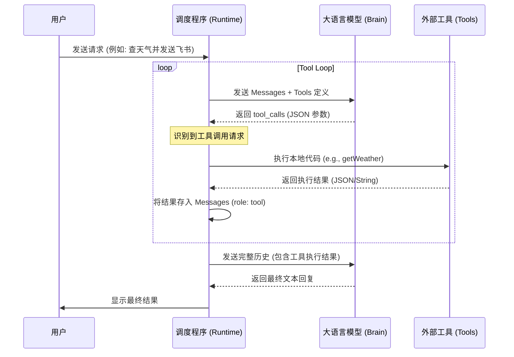
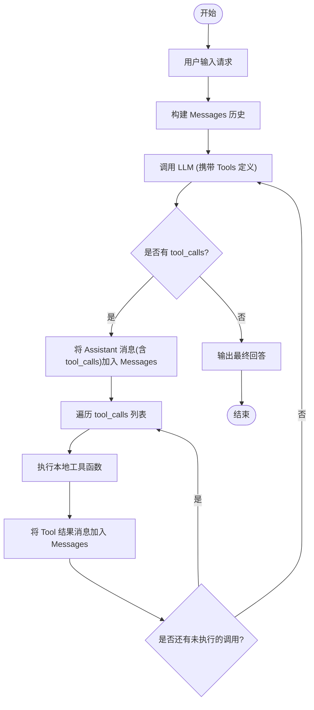

# 🎓 L02 实操课：解构 Agent 的“手” —— 原生 Tool Use 全流程

https://github.com/user-attachments/assets/8fe83a64-9ae5-4a0a-9e31-45a6ded4b5fe

本课程严格遵循“去框架化”理念，使用 Node.js 原生代码，通过**三个循序渐进的场景**（感知 -> 计算 -> 触达），解构 Agent 的工作原理。

**⏱️ 预计时长：** 45 分钟

**🎯 核心目标：**
1. **脱祛魅**：理解 LLM 不会“运行”工具，它只是在“填表”。
2. **懂协议**：掌握标准的 Request (Schema) -> Response (Tool Calls) -> Recursion (Loop) 循环。
3. **全场景**：覆盖“数据查询(Weather)”、“逻辑增强(Calculator)”、“外部副作用(Feishu)”三种典型模式。

---

## 📅 课程时间表 (Timeline)

| 阶段 | 时间 | 内容 | 关键知识点 |
| --- | --- | --- | --- |
| **I. 原理** | 00-05 min | **Stop-and-Act 机制** | LLM 是大脑，Tools 是手，中间通过 JSON 对话。 |
| **II. 定义** | 05-15 min | **定义工具集 (Schema)** | 编写 Weather、Calculator、Feishu 的 JSON Schema。 |
| **III. 调度** | 15-35 min | **编写 Tool Runner** | 实现**递归/循环**逻辑，处理工具分发与结果回传。 |
| **IV. 演练** | 35-45 min | **混合实战测试** | 一次对话触发多个工具，观察 Agent 的决策链。 |

---

## 📝 核心原理：多轮调用流程



### 🧠 逻辑运行流程 (Logic Flow)



---

## 🛠️ 运行指南

### 1. 课前准备
* Node.js 环境 (建议 v18+)
* 一个 LLM API Key (本例使用 DeepSeek)
* (可选) 飞书群机器人的 Webhook 地址

### 2. 配置环境变量
在终端中设置环境变量（或创建 `.env` 文件）：
```bash
export DEEPSEEK_API_KEY="your_api_key_here"
export FEISHU_WEBHOOK="your_webhook_url_here" # 可选，不设置则进入模拟模式
```

### 3. 安装并运行
```bash
npm install
npm run dev
```

---

## 📝 详细教案要点

### 1. 定义工具 (The Tool Box)
我们定义了三类能力维度：
* **感知型 (`get_weather`)**: 只读，获取外部实时数据。
* **增强型 (`calculator`)**: 纯逻辑，弥补 LLM 数学计算的短板。
* **触达型 (`post_to_feishu`)**: **副作用 (Action)**，产生现实世界的影响。

### 2. 核心调度逻辑 (The Loop)
教学重点在于处理“多步推理”：
1. **Check**: 检查 `tool_calls` 是否存在。
2. **Act**: 遍历并执行本地对应的函数。
3. **Append**: 必须将 `assistant` 的 `tool_calls` 消息和 `tool` 的结果消息**同时**回传给模型。
4. **Recursion**: 只要有工具调用，就继续循环，直到模型给出最终文本回复。

### 3. 常见坑点
* **回传必填**: 无论工具是否有意义（如发消息），必须回传一个结果（如 `{status: "ok"}`），否则对话流会断裂。
* **上下文膨胀**: 每次工具调用都会增加对话历史，注意 Token 消耗。
* **安全性**: 演示中的 `eval` 仅供教学，生产环境建议使用 `mathjs` 等库。

---

## 💡 讲师 Tips
* **关于飞书 Webhook**：如果没有现成机器人，代码会自动降级为 `console.log` 模拟输出，不影响逻辑演示。
* **互动环节**：可以尝试让模型一次性执行两个任务（例如：“查天气并计算...”），观察模型是串行还是并行生成 `tool_calls`。
