# MCP 架构流程图

本文档包含 MCP 协议的架构图和通信流程图。

## 0. 为什么需要 MCP？—— 集成灾难问题

在 MCP 出现之前，AI 应用集成数据源面临严重的碎片化问题：

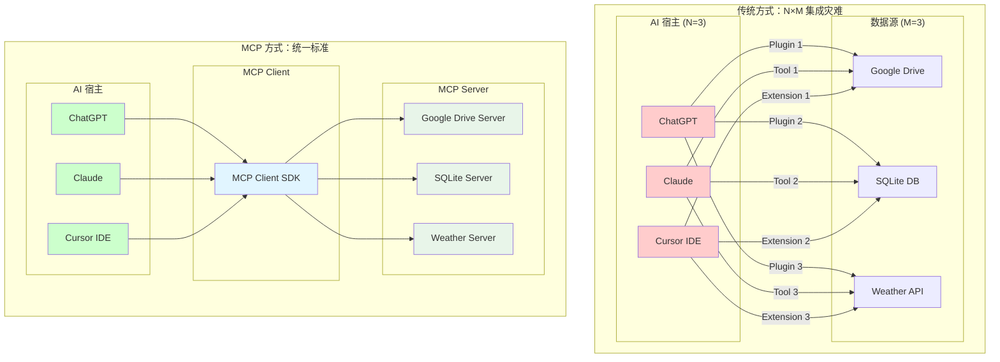
```mermaid
graph TB
    subgraph "传统方式：N×M 集成灾难"
        subgraph "AI 宿主 (N=3)"
            H1[ChatGPT]
            H2[Claude]
            H3[Cursor IDE]
        end
        
        subgraph "数据源 (M=3)"
            D1[Google Drive]
            D2[SQLite DB]
            D3[Weather API]
        end
        
        H1 -->|Plugin 1| D1
        H1 -->|Plugin 2| D2
        H1 -->|Plugin 3| D3
        H2 -->|Tool 1| D1
        H2 -->|Tool 2| D2
        H2 -->|Tool 3| D3
        H3 -->|Extension 1| D1
        H3 -->|Extension 2| D2
        H3 -->|Extension 3| D3
    end
    
    subgraph "MCP 方式：统一标准"
        subgraph "AI 宿主"
            H4[ChatGPT]
            H5[Claude]
            H6[Cursor IDE]
        end
        
        subgraph "MCP Client"
            C[MCP Client SDK]
        end
        
        subgraph "MCP Server"
            S1[Google Drive Server]
            S2[SQLite Server]
            S3[Weather Server]
        end
        
        H4 --> C
        H5 --> C
        H6 --> C
        C --> S1
        C --> S2
        C --> S3
    end
    
    style H1 fill:#ffcccc
    style H2 fill:#ffcccc
    style H3 fill:#ffcccc
    style H4 fill:#ccffcc
    style H5 fill:#ccffcc
    style H6 fill:#ccffcc
    style C fill:#e1f5ff
    style S1 fill:#e8f5e9
    style S2 fill:#e8f5e9
    style S3 fill:#e8f5e9
```

**问题分析：**
- **传统方式**：需要维护 **N×M = 9 个**连接器（3 个宿主 × 3 个数据源）
- **MCP 方式**：只需要维护 **M = 3 个** Server（每个数据源一个）
- **优势**：Server 只需实现一次 MCP 标准，所有 Host 都能使用

## 0.1. USB 协议类比

MCP 的设计哲学类似于 USB 协议：

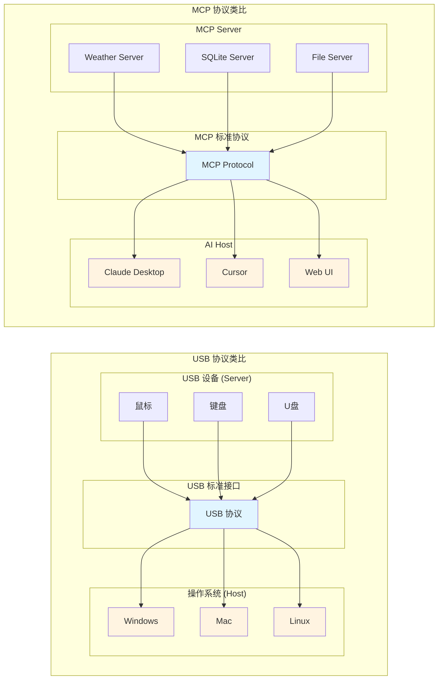
```mermaid
graph LR
    subgraph "USB 协议类比"
        subgraph "USB 设备 (Server)"
            USB1[鼠标]
            USB2[键盘]
            USB3[U盘]
        end
        
        subgraph "USB 标准接口"
            USB[USB 协议]
        end
        
        subgraph "操作系统 (Host)"
            OS1[Windows]
            OS2[Mac]
            OS3[Linux]
        end
        
        USB1 --> USB
        USB2 --> USB
        USB3 --> USB
        USB --> OS1
        USB --> OS2
        USB --> OS3
    end
    
    subgraph "MCP 协议类比"
        subgraph "MCP Server"
            MCP1[Weather Server]
            MCP2[SQLite Server]
            MCP3[File Server]
        end
        
        subgraph "MCP 标准协议"
            MCP[MCP Protocol]
        end
        
        subgraph "AI Host"
            AI1[Claude Desktop]
            AI2[Cursor]
            AI3[Web UI]
        end
        
        MCP1 --> MCP
        MCP2 --> MCP
        MCP3 --> MCP
        MCP --> AI1
        MCP --> AI2
        MCP --> AI3
    end
    
    style USB fill:#e1f5ff
    style MCP fill:#e1f5ff
    style OS1 fill:#fff4e1
    style OS2 fill:#fff4e1
    style OS3 fill:#fff4e1
    style AI1 fill:#fff4e1
    style AI2 fill:#fff4e1
    style AI3 fill:#fff4e1
```

**核心思想**：设备（Server）只需符合标准，就能在任何系统（Host）上工作。

## 1. 核心架构图

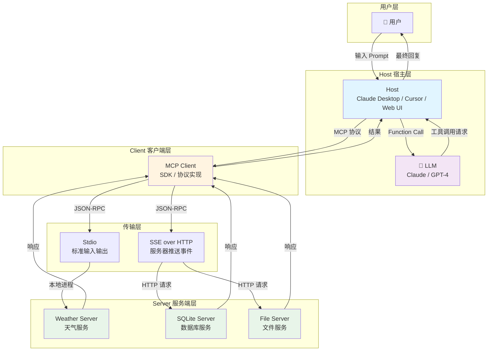
```mermaid
graph TB
    subgraph "用户层"
        User[👤 用户]
    end

    subgraph "Host 宿主层"
        Host[Host<br/>Claude Desktop / Cursor / Web UI]
        LLM[🧠 LLM<br/>Claude / GPT-4]
    end

    subgraph "Client 客户端层"
        Client[MCP Client<br/>SDK / 协议实现]
    end

    subgraph "传输层"
        Stdio[Stdio<br/>标准输入输出]
        SSE[SSE over HTTP<br/>服务器推送事件]
    end

    subgraph "Server 服务端层"
        Server1[Weather Server<br/>天气服务]
        Server2[SQLite Server<br/>数据库服务]
        Server3[File Server<br/>文件服务]
    end

    User -->|输入 Prompt| Host
    Host -->|Function Call| LLM
    LLM -->|工具调用请求| Host
    Host -->|MCP 协议| Client
    Client -->|JSON-RPC| Stdio
    Client -->|JSON-RPC| SSE
    Stdio -->|本地进程| Server1
    SSE -->|HTTP 请求| Server2
    SSE -->|HTTP 请求| Server3
    Server1 -->|响应| Client
    Server2 -->|响应| Client
    Server3 -->|响应| Client
    Client -->|结果| Host
    Host -->|最终回复| User

    style Host fill:#e1f5ff
    style Client fill:#fff4e1
    style Server1 fill:#e8f5e9
    style Server2 fill:#e8f5e9
    style Server3 fill:#e8f5e9
    style LLM fill:#f3e5f5
```

## 2. 连接建立完整时序图（Stdio 传输）

> ⭐ **重要**：连接时序图是理解 MCP 协议的核心。这个时序图展示了从进程启动到连接就绪的完整过程，包括进程管理、事件监听、握手协议等关键步骤。

这是最详细的连接建立流程，展示从进程启动到就绪的完整过程：

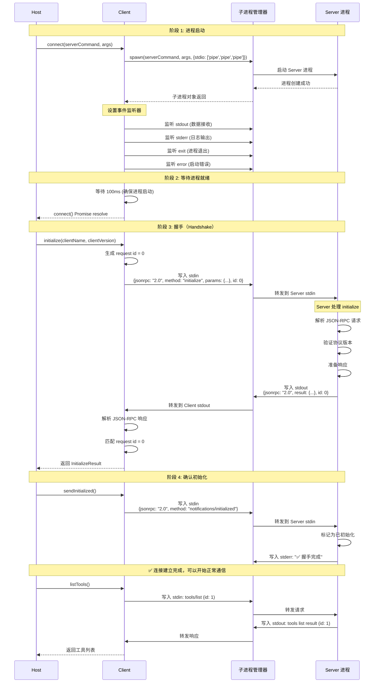
```mermaid
sequenceDiagram
    participant H as Host
    participant C as Client
    participant P as 子进程管理器
    participant S as Server 进程

    Note over H,S: 阶段 1: 进程启动

    H->>C: connect(serverCommand, args)
    C->>P: spawn(serverCommand, args, {stdio: ['pipe','pipe','pipe']})
    P->>S: 启动 Server 进程
    S-->>P: 进程创建成功
    P-->>C: 子进程对象返回
    
    Note over C: 设置事件监听器
    C->>P: 监听 stdout (数据接收)
    C->>P: 监听 stderr (日志输出)
    C->>P: 监听 exit (进程退出)
    C->>P: 监听 error (启动错误)
    
    Note over H,S: 阶段 2: 等待进程就绪
    
    C->>C: 等待 100ms (确保进程启动)
    C-->>H: connect() Promise resolve
    
    Note over H,S: 阶段 3: 握手（Handshake）
    
    H->>C: initialize(clientName, clientVersion)
    C->>C: 生成 request id = 0
    C->>P: 写入 stdin<br/>{jsonrpc: "2.0", method: "initialize", params: {...}, id: 0}
    P->>S: 转发到 Server stdin
    
    Note over S: Server 处理 initialize
    S->>S: 解析 JSON-RPC 请求
    S->>S: 验证协议版本
    S->>S: 准备响应
    
    S->>P: 写入 stdout<br/>{jsonrpc: "2.0", result: {...}, id: 0}
    P->>C: 转发到 Client stdout
    C->>C: 解析 JSON-RPC 响应
    C->>C: 匹配 request id = 0
    C-->>H: 返回 InitializeResult
    
    Note over H,S: 阶段 4: 确认初始化
    
    H->>C: sendInitialized()
    C->>P: 写入 stdin<br/>{jsonrpc: "2.0", method: "notifications/initialized"}
    P->>S: 转发到 Server stdin
    S->>S: 标记为已初始化
    S->>P: 写入 stderr: "✅ 握手完成"
    
    Note over H,S: ✅ 连接建立完成，可以开始正常通信
    
    H->>C: listTools()
    C->>P: 写入 stdin: tools/list (id: 1)
    P->>S: 转发请求
    S->>P: 写入 stdout: tools list result (id: 1)
    P->>C: 转发响应
    C-->>H: 返回工具列表
```

## 2.1. 连接建立完整时序图（SSE 传输）

> ⭐ **重要**：SSE 传输与 Stdio 传输的主要区别在于连接建立方式。SSE 使用 HTTP 长连接，支持远程部署，需要处理心跳机制保持连接。

SSE over HTTP 的连接建立流程：

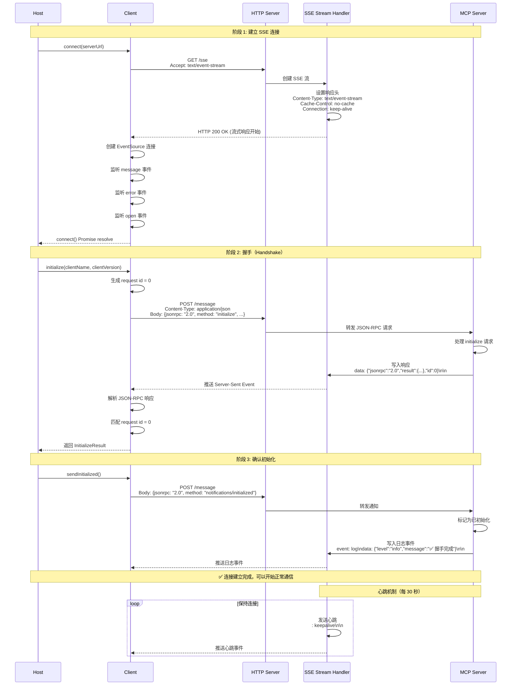
```mermaid
sequenceDiagram
    participant H as Host
    participant C as Client
    participant HTTP as HTTP Server
    participant SSE as SSE Stream Handler
    participant S as MCP Server

    Note over H,S: 阶段 1: 建立 SSE 连接

    H->>C: connect(serverUrl)
    C->>HTTP: GET /sse<br/>Accept: text/event-stream
    HTTP->>SSE: 创建 SSE 流
    SSE->>SSE: 设置响应头<br/>Content-Type: text/event-stream<br/>Cache-Control: no-cache<br/>Connection: keep-alive
    SSE-->>C: HTTP 200 OK (流式响应开始)
    C->>C: 创建 EventSource 连接
    C->>C: 监听 message 事件
    C->>C: 监听 error 事件
    C->>C: 监听 open 事件
    C-->>H: connect() Promise resolve

    Note over H,S: 阶段 2: 握手（Handshake）

    H->>C: initialize(clientName, clientVersion)
    C->>C: 生成 request id = 0
    C->>HTTP: POST /message<br/>Content-Type: application/json<br/>Body: {jsonrpc: "2.0", method: "initialize", ...}
    HTTP->>S: 转发 JSON-RPC 请求
    S->>S: 处理 initialize 请求
    S->>SSE: 写入响应<br/>data: {"jsonrpc":"2.0","result":{...},"id":0}\n\n
    SSE-->>C: 推送 Server-Sent Event
    C->>C: 解析 JSON-RPC 响应
    C->>C: 匹配 request id = 0
    C-->>H: 返回 InitializeResult

    Note over H,S: 阶段 3: 确认初始化

    H->>C: sendInitialized()
    C->>HTTP: POST /message<br/>Body: {jsonrpc: "2.0", method: "notifications/initialized"}
    HTTP->>S: 转发通知
    S->>S: 标记为已初始化
    S->>SSE: 写入日志事件<br/>event: log\ndata: {"level":"info","message":"✅ 握手完成"}\n\n
    SSE-->>C: 推送日志事件

    Note over H,S: ✅ 连接建立完成，可以开始正常通信

    Note over SSE,S: 心跳机制（每 30 秒）
    loop 保持连接
        SSE->>SSE: 发送心跳<br/>: keepalive\n\n
        SSE-->>C: 推送心跳事件
    end
```

## 2.2. 连接断开和清理时序图

> ⭐ **重要**：连接断开是生产环境中必须正确处理的关键场景。包括正常断开、异常断开、网络断开等多种情况，每种情况都需要正确的资源清理和错误处理。

展示正常断开和异常断开的处理：

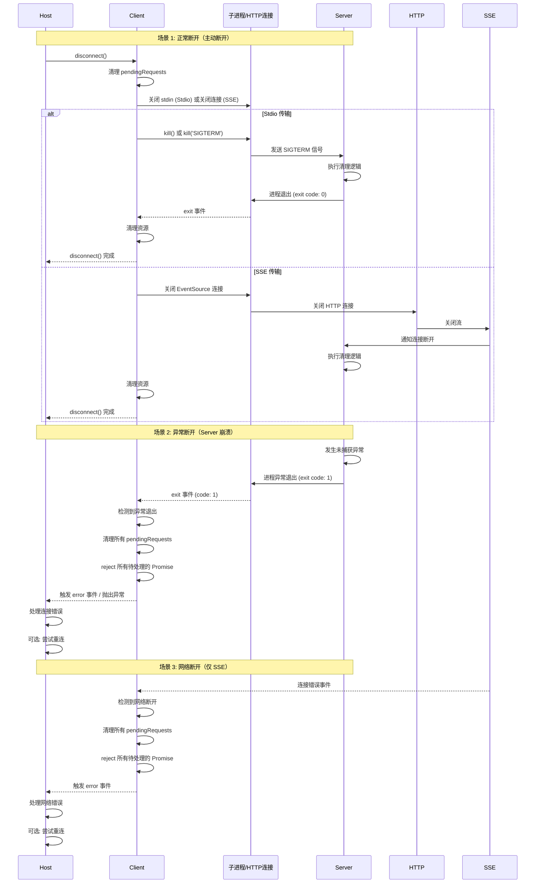
```mermaid
sequenceDiagram
    participant H as Host
    participant C as Client
    participant P as 子进程/HTTP连接
    participant S as Server

    Note over H,S: 场景 1: 正常断开（主动断开）

    H->>C: disconnect()
    C->>C: 清理 pendingRequests
    C->>P: 关闭 stdin (Stdio) 或关闭连接 (SSE)
    
    alt Stdio 传输
        C->>P: kill() 或 kill('SIGTERM')
        P->>S: 发送 SIGTERM 信号
        S->>S: 执行清理逻辑
        S->>P: 进程退出 (exit code: 0)
        P-->>C: exit 事件
        C->>C: 清理资源
        C-->>H: disconnect() 完成
    else SSE 传输
        C->>P: 关闭 EventSource 连接
        P->>HTTP: 关闭 HTTP 连接
        HTTP->>SSE: 关闭流
        SSE->>S: 通知连接断开
        S->>S: 执行清理逻辑
        C->>C: 清理资源
        C-->>H: disconnect() 完成
    end

    Note over H,S: 场景 2: 异常断开（Server 崩溃）

    S->>S: 发生未捕获异常
    S->>P: 进程异常退出 (exit code: 1)
    P-->>C: exit 事件 (code: 1)
    C->>C: 检测到异常退出
    C->>C: 清理所有 pendingRequests
    C->>C: reject 所有待处理的 Promise
    C-->>H: 触发 error 事件 / 抛出异常
    H->>H: 处理连接错误
    H->>H: 可选: 尝试重连

    Note over H,S: 场景 3: 网络断开（仅 SSE）

    SSE-->>C: 连接错误事件
    C->>C: 检测到网络断开
    C->>C: 清理所有 pendingRequests
    C->>C: reject 所有待处理的 Promise
    C-->>H: 触发 error 事件
    H->>H: 处理网络错误
    H->>H: 可选: 尝试重连
```

## 2.3. 重连机制时序图

> ⭐ **重要**：重连机制保证了系统的健壮性。当连接意外断开时，自动重连可以恢复服务，避免用户手动干预。重连策略通常包括指数退避、最大重试次数等。

展示自动重连的实现：

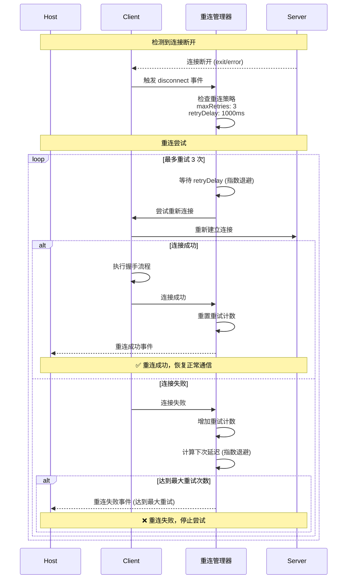
```mermaid
sequenceDiagram
    participant H as Host
    participant C as Client
    participant RM as 重连管理器
    participant S as Server

    Note over H,S: 检测到连接断开

    S-->>C: 连接断开 (exit/error)
    C->>RM: 触发 disconnect 事件
    RM->>RM: 检查重连策略<br/>maxRetries: 3<br/>retryDelay: 1000ms

    Note over H,S: 重连尝试

    loop 最多重试 3 次
        RM->>RM: 等待 retryDelay (指数退避)
        RM->>C: 尝试重新连接
        C->>S: 重新建立连接
        
        alt 连接成功
            C->>C: 执行握手流程
            C->>RM: 连接成功
            RM->>RM: 重置重试计数
            RM-->>H: 重连成功事件
            Note over H,S: ✅ 重连成功，恢复正常通信
        else 连接失败
            C->>RM: 连接失败
            RM->>RM: 增加重试计数
            RM->>RM: 计算下次延迟 (指数退避)
            
            alt 达到最大重试次数
                RM-->>H: 重连失败事件 (达到最大重试)
                Note over H,S: ❌ 重连失败，停止尝试
            end
        end
    end
```

## 2.4. 多 Server 并发连接时序图

> ⭐ **重要**：在实际应用中，一个 Host 通常需要同时连接多个 Server 以获取不同的能力。并发连接可以显著提高系统性能，但需要正确处理并发场景下的资源管理和错误处理。

展示 Host 同时连接多个 Server 的时序：

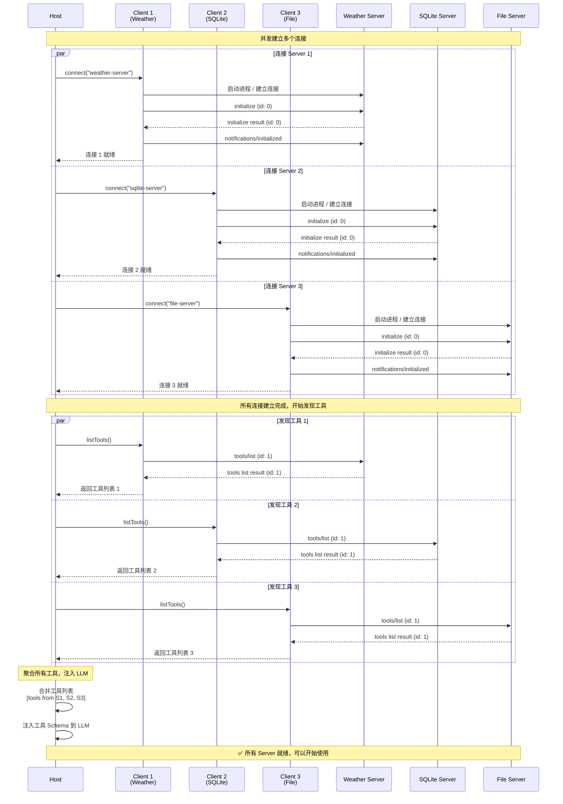
```mermaid
sequenceDiagram
    participant H as Host
    participant C1 as Client 1<br/>(Weather)
    participant C2 as Client 2<br/>(SQLite)
    participant C3 as Client 3<br/>(File)
    participant S1 as Weather Server
    participant S2 as SQLite Server
    participant S3 as File Server

    Note over H,S3: 并发建立多个连接

    par 连接 Server 1
        H->>C1: connect("weather-server")
        C1->>S1: 启动进程 / 建立连接
        C1->>S1: initialize (id: 0)
        S1-->>C1: initialize result (id: 0)
        C1->>S1: notifications/initialized
        C1-->>H: 连接 1 就绪
    and 连接 Server 2
        H->>C2: connect("sqlite-server")
        C2->>S2: 启动进程 / 建立连接
        C2->>S2: initialize (id: 0)
        S2-->>C2: initialize result (id: 0)
        C2->>S2: notifications/initialized
        C2-->>H: 连接 2 就绪
    and 连接 Server 3
        H->>C3: connect("file-server")
        C3->>S3: 启动进程 / 建立连接
        C3->>S3: initialize (id: 0)
        S3-->>C3: initialize result (id: 0)
        C3->>S3: notifications/initialized
        C3-->>H: 连接 3 就绪
    end

    Note over H,S3: 所有连接建立完成，开始发现工具

    par 发现工具 1
        H->>C1: listTools()
        C1->>S1: tools/list (id: 1)
        S1-->>C1: tools list result (id: 1)
        C1-->>H: 返回工具列表 1
    and 发现工具 2
        H->>C2: listTools()
        C2->>S2: tools/list (id: 1)
        S2-->>C2: tools list result (id: 1)
        C2-->>H: 返回工具列表 2
    and 发现工具 3
        H->>C3: listTools()
        C3->>S3: tools/list (id: 1)
        S3-->>C3: tools list result (id: 1)
        C3-->>H: 返回工具列表 3
    end

    Note over H: 聚合所有工具，注入 LLM

    H->>H: 合并工具列表<br/>[tools from S1, S2, S3]
    H->>H: 注入工具 Schema 到 LLM

    Note over H,S3: ✅ 所有 Server 就绪，可以开始使用
```

## 2.5. 握手流程（简化版）

这是握手流程的简化版本，突出核心步骤：

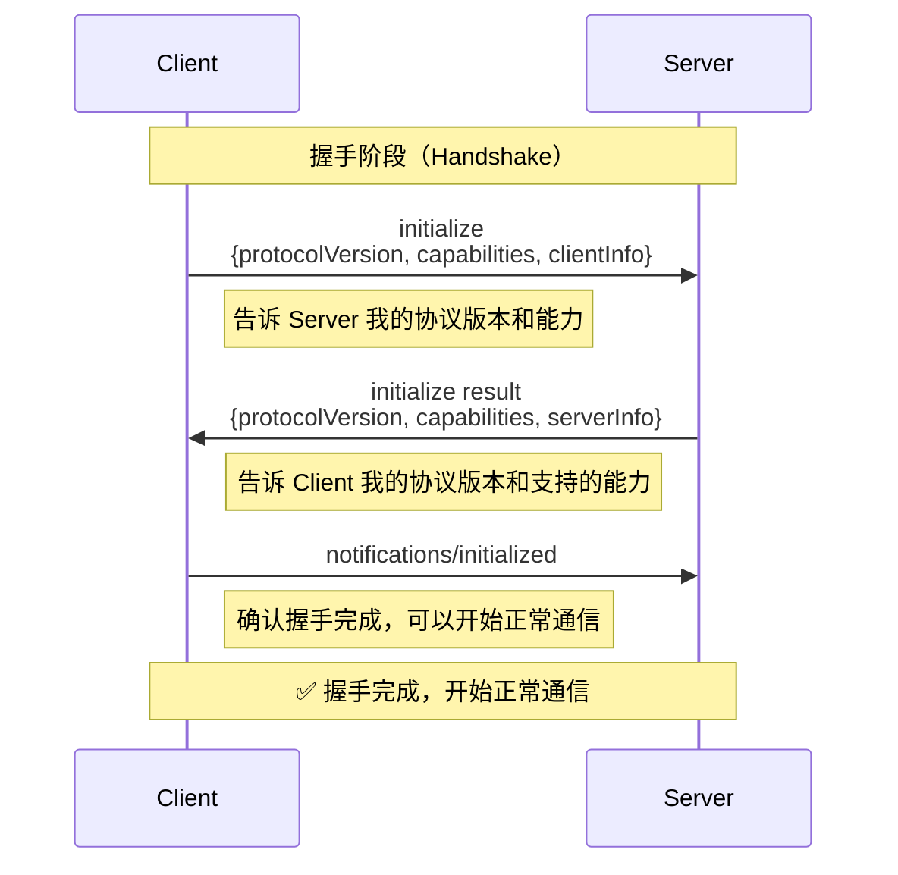
```mermaid
sequenceDiagram
    participant C as Client
    participant S as Server

    Note over C,S: 握手阶段（Handshake）

    C->>S: initialize<br/>{protocolVersion, capabilities, clientInfo}
    Note right of C: 告诉 Server 我的协议版本和能力

    S->>C: initialize result<br/>{protocolVersion, capabilities, serverInfo}
    Note left of S: 告诉 Client 我的协议版本和支持的能力

    C->>S: notifications/initialized
    Note right of C: 确认握手完成，可以开始正常通信

    Note over C,S: ✅ 握手完成，开始正常通信
```

## 3. 工具发现流程（Discovery）

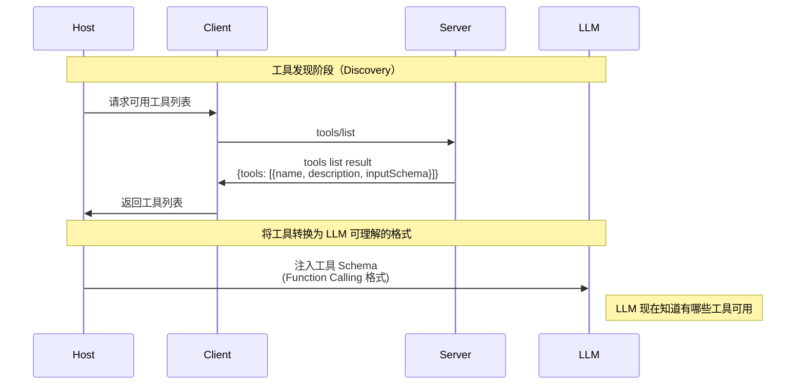
```mermaid
sequenceDiagram
    participant H as Host
    participant C as Client
    participant S as Server
    participant L as LLM

    Note over H,L: 工具发现阶段（Discovery）

    H->>C: 请求可用工具列表
    C->>S: tools/list
    S->>C: tools list result<br/>{tools: [{name, description, inputSchema}]}
    C->>H: 返回工具列表

    Note over H,L: 将工具转换为 LLM 可理解的格式

    H->>L: 注入工具 Schema<br/>(Function Calling 格式)
    Note right of L: LLM 现在知道有哪些工具可用
```

## 4. 工具执行流程（Execution）

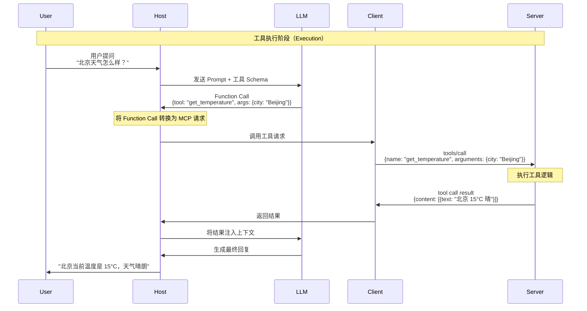
```mermaid
sequenceDiagram
    participant U as User
    participant H as Host
    participant L as LLM
    participant C as Client
    participant S as Server

    Note over U,S: 工具执行阶段（Execution）

    U->>H: 用户提问<br/>"北京天气怎么样？"
    H->>L: 发送 Prompt + 工具 Schema
    L->>H: Function Call<br/>{tool: "get_temperature", args: {city: "Beijing"}}

    Note over H: 将 Function Call 转换为 MCP 请求

    H->>C: 调用工具请求
    C->>S: tools/call<br/>{name: "get_temperature", arguments: {city: "Beijing"}}
    
    Note over S: 执行工具逻辑

    S->>C: tool call result<br/>{content: [{text: "北京 15°C 晴"}]}
    C->>H: 返回结果
    H->>L: 将结果注入上下文
    L->>H: 生成最终回复
    H->>U: "北京当前温度是 15°C，天气晴朗"
```

## 5. 完整通信流程（完整示例）

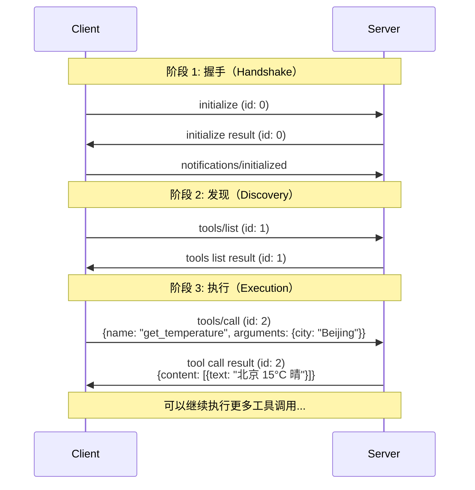
```mermaid
sequenceDiagram
    participant C as Client
    participant S as Server

    Note over C,S: 阶段 1: 握手（Handshake）

    C->>S: initialize (id: 0)
    S->>C: initialize result (id: 0)
    C->>S: notifications/initialized

    Note over C,S: 阶段 2: 发现（Discovery）

    C->>S: tools/list (id: 1)
    S->>C: tools list result (id: 1)

    Note over C,S: 阶段 3: 执行（Execution）

    C->>S: tools/call (id: 2)<br/>{name: "get_temperature", arguments: {city: "Beijing"}}
    S->>C: tool call result (id: 2)<br/>{content: [{text: "北京 15°C 晴"}]}

    Note over C,S: 可以继续执行更多工具调用...
```

## 6. MCP vs Function Calling 对比

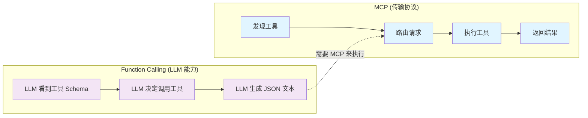
```mermaid
graph LR
    subgraph "Function Calling (LLM 能力)"
        FC1[LLM 看到工具 Schema]
        FC2[LLM 决定调用工具]
        FC3[LLM 生成 JSON 文本]
        FC1 --> FC2 --> FC3
    end

    subgraph "MCP (传输协议)"
        MCP1[发现工具]
        MCP2[路由请求]
        MCP3[执行工具]
        MCP4[返回结果]
        MCP1 --> MCP2 --> MCP3 --> MCP4
    end

    FC3 -.->|"需要 MCP 来执行"| MCP2

    style FC1 fill:#f3e5f5
    style FC2 fill:#f3e5f5
    style FC3 fill:#f3e5f5
    style MCP1 fill:#e1f5ff
    style MCP2 fill:#e1f5ff
    style MCP3 fill:#e1f5ff
    style MCP4 fill:#e1f5ff
```

## 7. Stdio vs SSE 传输对比

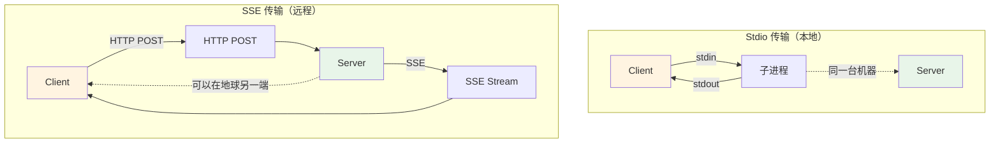
```mermaid
graph TB
    subgraph "Stdio 传输（本地）"
        C1[Client]
        P1[子进程]
        S1[Server]
        C1 -->|stdin| P1
        P1 -->|stdout| C1
        P1 -.->|"同一台机器"| S1
    end

    subgraph "SSE 传输（远程）"
        C2[Client]
        HTTP[HTTP POST]
        SSE[SSE Stream]
        S2[Server]
        C2 -->|HTTP POST| HTTP
        HTTP --> S2
        S2 -->|SSE| SSE
        SSE --> C2
        S2 -.->|"可以在地球另一端"| C2
    end

    style C1 fill:#fff4e1
    style S1 fill:#e8f5e9
    style C2 fill:#fff4e1
    style S2 fill:#e8f5e9
```

## 8. JSON-RPC 消息格式

```mermaid
graph TB
    subgraph "Request 请求"
        R1[jsonrpc: '2.0']
        R2[method: 'tools/call']
        R3[params: {...}]
        R4[id: 1]
        R1 --> R2 --> R3 --> R4
    end

    subgraph "Response 响应"
        RES1[jsonrpc: '2.0']
        RES2[result: {...}]
        RES3[id: 1]
        RES1 --> RES2 --> RES3
    end

    subgraph "Notification 通知"
        N1[jsonrpc: '2.0']
        N2[method: 'notifications/initialized']
        N3[无 id 字段]
        N1 --> N2 --> N3
    end

    style R1 fill:#e1f5ff
    style RES1 fill:#e8f5e9
    style N1 fill:#fff4e1
```

## 关键概念说明

### Host（宿主）
- **定义**：用户直接交互的程序
- **职责**：管理生命周期，聚合 Prompt 和工具，与 LLM 交互

### Client（客户端）
- **定义**：Host 内部的组件，实现 MCP 协议
- **职责**：维持与 Server 的连接，转换 Function Call 为 MCP 请求

### Server（服务端）
- **定义**：能力的提供者
- **职责**：暴露 Tools、Resources、Prompts

### 协议版本
- 当前版本：`2024-11-05`
- 采用日期格式，便于理解版本演进

### 传输方式
- **Stdio**：本地进程通信，零延迟，安全
- **SSE over HTTP**：远程服务，支持分布式部署

## 9. 协议栈分层图

MCP 协议的分层架构：

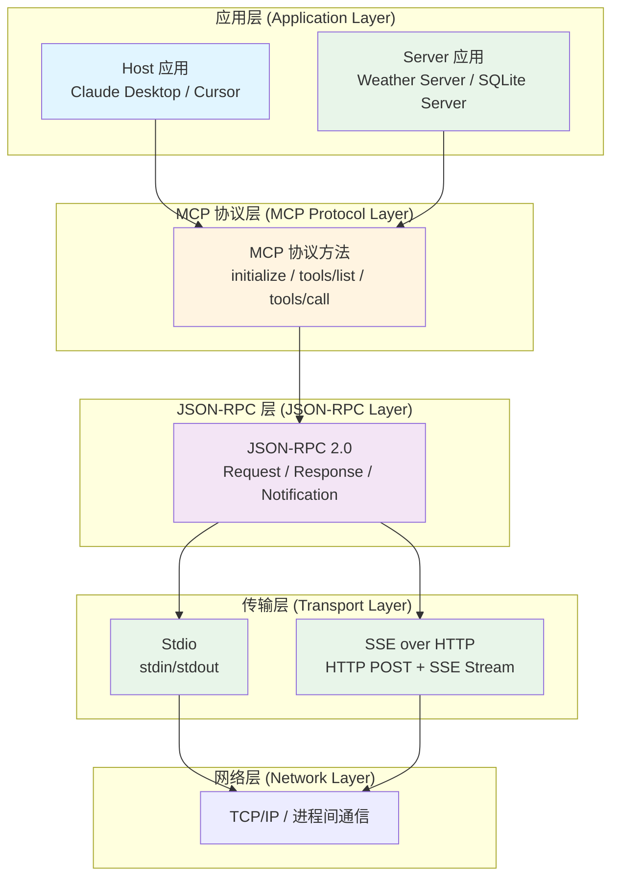
```mermaid
graph TB
    subgraph "应用层 (Application Layer)"
        APP1[Host 应用<br/>Claude Desktop / Cursor]
        APP2[Server 应用<br/>Weather Server / SQLite Server]
    end
    
    subgraph "MCP 协议层 (MCP Protocol Layer)"
        MCP_PROTOCOL[MCP 协议方法<br/>initialize / tools/list / tools/call]
    end
    
    subgraph "JSON-RPC 层 (JSON-RPC Layer)"
        JSONRPC[JSON-RPC 2.0<br/>Request / Response / Notification]
    end
    
    subgraph "传输层 (Transport Layer)"
        STDIO[Stdio<br/>stdin/stdout]
        SSE[SSE over HTTP<br/>HTTP POST + SSE Stream]
    end
    
    subgraph "网络层 (Network Layer)"
        NET[TCP/IP / 进程间通信]
    end
    
    APP1 --> MCP_PROTOCOL
    APP2 --> MCP_PROTOCOL
    MCP_PROTOCOL --> JSONRPC
    JSONRPC --> STDIO
    JSONRPC --> SSE
    STDIO --> NET
    SSE --> NET
    
    style APP1 fill:#e1f5ff
    style APP2 fill:#e8f5e9
    style MCP_PROTOCOL fill:#fff4e1
    style JSONRPC fill:#f3e5f5
    style STDIO fill:#e8f5e9
    style SSE fill:#e8f5e9
```

## 10. 生命周期状态图

Client 和 Server 的状态转换：

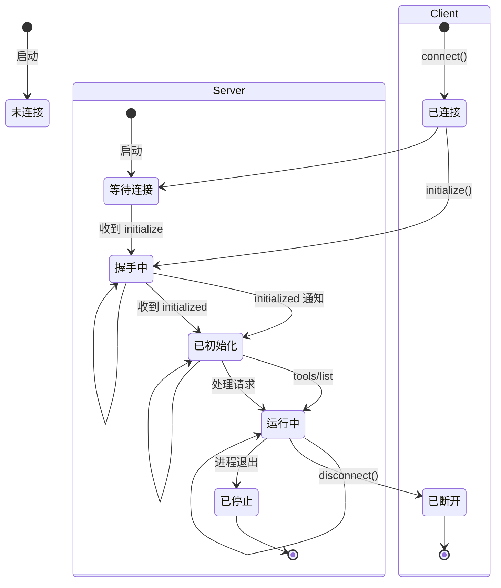
```mermaid
stateDiagram-v2
    [*] --> 未连接: 启动
    
    state Client {
        [*] --> 已连接: connect()
        已连接 --> 握手中: initialize()
        握手中 --> 已初始化: initialized 通知
        已初始化 --> 运行中: tools/list
        运行中 --> 运行中: tools/call
        运行中 --> 已断开: disconnect()
        已断开 --> [*]
    }
    
    state Server {
        [*] --> 等待连接: 启动
        等待连接 --> 握手中: 收到 initialize
        握手中 --> 已初始化: 收到 initialized
        已初始化 --> 运行中: 处理请求
        运行中 --> 运行中: 处理 tools/call
        运行中 --> 已停止: 进程退出
        已停止 --> [*]
    }
    
    已连接 --> 等待连接
    握手中 --> 握手中
    已初始化 --> 已初始化
    运行中 --> 运行中
```

## 11. 多 Server 连接架构

一个 Host 可以同时连接多个 Server：

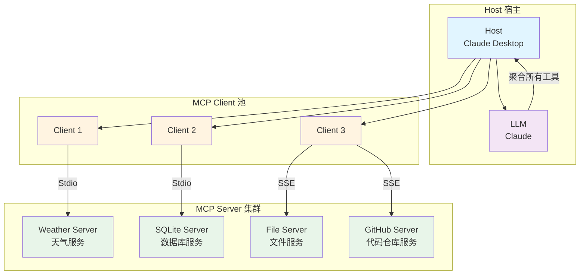
```mermaid
graph TB
    subgraph "Host 宿主"
        H[Host<br/>Claude Desktop]
        LLM[LLM<br/>Claude]
    end
    
    subgraph "MCP Client 池"
        C1[Client 1]
        C2[Client 2]
        C3[Client 3]
    end
    
    subgraph "MCP Server 集群"
        S1[Weather Server<br/>天气服务]
        S2[SQLite Server<br/>数据库服务]
        S3[File Server<br/>文件服务]
        S4[GitHub Server<br/>代码仓库服务]
    end
    
    H --> LLM
    H --> C1
    H --> C2
    H --> C3
    
    C1 -->|Stdio| S1
    C2 -->|Stdio| S2
    C3 -->|SSE| S3
    C3 -->|SSE| S4
    
    LLM -->|聚合所有工具| H
    
    style H fill:#e1f5ff
    style LLM fill:#f3e5f5
    style C1 fill:#fff4e1
    style C2 fill:#fff4e1
    style C3 fill:#fff4e1
    style S1 fill:#e8f5e9
    style S2 fill:#e8f5e9
    style S3 fill:#e8f5e9
    style S4 fill:#e8f5e9
```

**说明：**
- Host 可以同时连接多个 Server
- 每个 Server 提供不同的能力（Tools、Resources、Prompts）
- Host 将所有工具聚合后注入 LLM
- LLM 可以调用任意 Server 的工具

## 12. 数据流图（完整流程）

展示数据在系统中的完整流动：

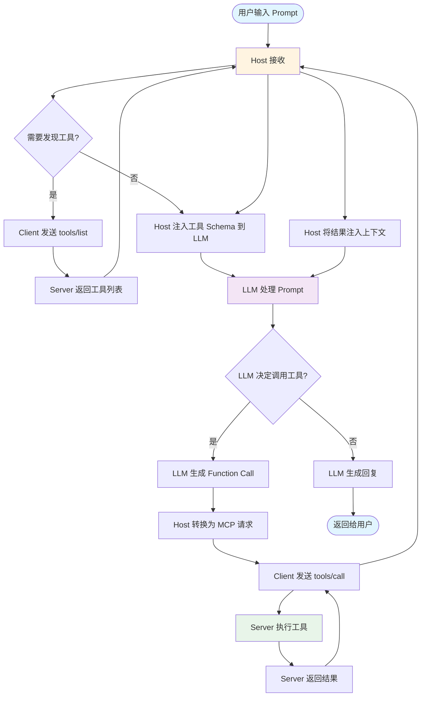
```mermaid
flowchart TD
    START([用户输入 Prompt]) --> HOST[Host 接收]
    
    HOST --> DISCOVERY{需要发现工具?}
    DISCOVERY -->|是| CLIENT1[Client 发送 tools/list]
    CLIENT1 --> SERVER1[Server 返回工具列表]
    SERVER1 --> HOST
    DISCOVERY -->|否| INJECT
    
    HOST --> INJECT[Host 注入工具 Schema 到 LLM]
    INJECT --> LLM[LLM 处理 Prompt]
    
    LLM --> DECIDE{LLM 决定调用工具?}
    DECIDE -->|否| RESPONSE[LLM 生成回复]
    DECIDE -->|是| FCALL[LLM 生成 Function Call]
    
    FCALL --> CONVERT[Host 转换为 MCP 请求]
    CONVERT --> CLIENT2[Client 发送 tools/call]
    CLIENT2 --> SERVER2[Server 执行工具]
    SERVER2 --> RESULT[Server 返回结果]
    RESULT --> CLIENT2
    CLIENT2 --> HOST
    HOST --> INJECT2[Host 将结果注入上下文]
    INJECT2 --> LLM
    
    RESPONSE --> USER([返回给用户])
    
    style START fill:#e1f5ff
    style HOST fill:#fff4e1
    style LLM fill:#f3e5f5
    style SERVER2 fill:#e8f5e9
    style USER fill:#e1f5ff
```

## 13. 错误处理流程

展示错误在系统中的传播和处理：

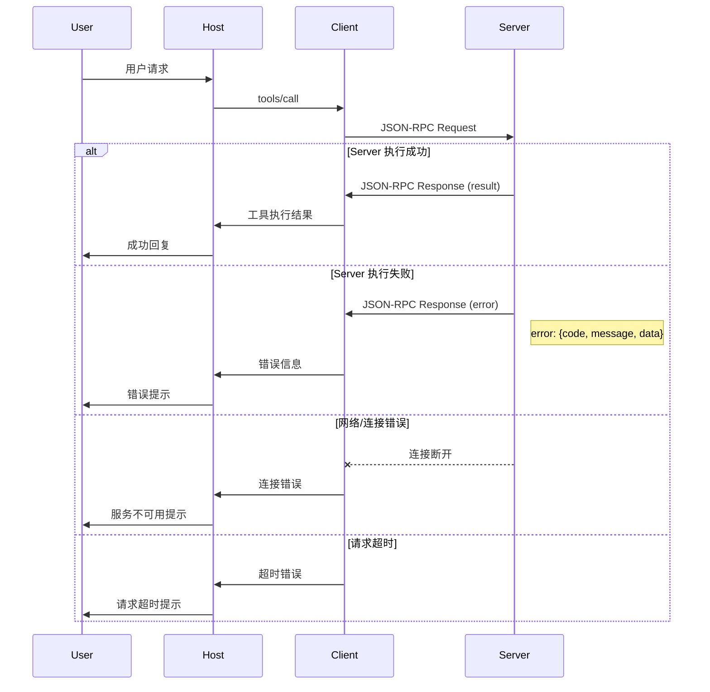
```mermaid
sequenceDiagram
    participant U as User
    participant H as Host
    participant C as Client
    participant S as Server
    
    U->>H: 用户请求
    H->>C: tools/call
    C->>S: JSON-RPC Request
    
    alt Server 执行成功
        S->>C: JSON-RPC Response (result)
        C->>H: 工具执行结果
        H->>U: 成功回复
    else Server 执行失败
        S->>C: JSON-RPC Response (error)
        Note right of S: error: {code, message, data}
        C->>H: 错误信息
        H->>U: 错误提示
    else 网络/连接错误
        S--xC: 连接断开
        C->>H: 连接错误
        H->>U: 服务不可用提示
    else 请求超时
        C->>H: 超时错误
        H->>U: 请求超时提示
    end
```

## 14. 工具 Schema 转换流程

展示工具 Schema 从 MCP 格式到 LLM Function Calling 格式的转换：

```mermaid
graph LR
    subgraph "MCP Server 格式"
        MCP_SCHEMA["MCP Tool Schema<br/>{<br/>  name: 'get_temperature',<br/>  description: '获取温度',<br/>  inputSchema: {<br/>    type: 'object',<br/>    properties: {<br/>      city: { type: 'string' }<br/>    }<br/>  }<br/>}"]
    end
    
    subgraph "转换层"
        CONVERT[Host 转换逻辑]
    end
    
    subgraph "LLM Function Calling 格式"
        LLM_SCHEMA["Function Schema<br/>{<br/>  name: 'get_temperature',<br/>  description: '获取温度',<br/>  parameters: {<br/>    type: 'object',<br/>    properties: {<br/>      city: { type: 'string' }<br/>    }<br/>  }<br/>}"]
    end
    
    subgraph "LLM 输出"
        LLM_OUTPUT["Function Call<br/>{<br/>  tool: 'get_temperature',<br/>  args: { city: 'Beijing' }<br/>}"]
    end
    
    subgraph "转换回 MCP"
        MCP_CALL["MCP tools/call<br/>{<br/>  name: 'get_temperature',<br/>  arguments: { city: 'Beijing' }<br/>}"]
    end
    
    MCP_SCHEMA --> CONVERT
    CONVERT --> LLM_SCHEMA
    LLM_SCHEMA --> LLM_OUTPUT
    LLM_OUTPUT --> CONVERT
    CONVERT --> MCP_CALL
    
    style MCP_SCHEMA fill:#e8f5e9
    style CONVERT fill:#fff4e1
    style LLM_SCHEMA fill:#f3e5f5
    style LLM_OUTPUT fill:#f3e5f5
    style MCP_CALL fill:#e8f5e9
```

## 15. Stdio 传输详细流程

展示 Stdio 传输的详细实现：

```mermaid
sequenceDiagram
    participant H as Host
    participant C as Client
    participant P as 子进程
    participant S as Server 进程
    
    Note over H,S: Stdio 传输详细流程
    
    H->>C: 启动连接请求
    C->>P: spawn('server.js')
    P->>S: 启动 Server 进程
    S-->>P: 进程就绪
    
    Note over C,S: 建立通信通道
    
    C->>P: 写入 stdin (JSON-RPC Request)
    P->>S: 转发到 Server stdin
    S->>S: 处理请求
    S->>P: 写入 stdout (JSON-RPC Response)
    P->>C: 转发到 Client stdout
    C->>H: 返回结果
    
    Note over C,S: 错误处理
    
    S->>P: 写入 stderr (日志)
    P->>C: 转发到 Client stderr
    C->>H: 显示日志
    
    alt 进程异常退出
        S-->>P: exit(code)
        P-->>C: exit 事件
        C->>H: 连接断开通知
    end
```

## 16. SSE 传输详细流程

展示 SSE over HTTP 传输的详细实现：

```mermaid
sequenceDiagram
    participant H as Host
    participant C as Client
    participant HTTP as HTTP Server
    participant SSE as SSE Stream
    participant S as MCP Server
    
    Note over H,S: SSE over HTTP 传输详细流程
    
    H->>C: 启动连接请求
    C->>HTTP: GET /sse (建立 SSE 连接)
    HTTP->>SSE: 创建 SSE 流
    SSE->>C: 连接建立 (text/event-stream)
    
    Note over C,S: 双向通信
    
    C->>HTTP: POST /message (JSON-RPC Request)
    HTTP->>S: 转发请求
    S->>S: 处理请求
    S->>SSE: 写入响应 (data: {...})
    SSE->>C: 推送响应 (Server-Sent Event)
    C->>H: 返回结果
    
    Note over C,S: 心跳保持连接
    
    loop 每 30 秒
        SSE->>C: 发送心跳 (comment)
    end
    
    alt 连接断开
        C->>HTTP: 关闭连接
        HTTP->>SSE: 关闭流
        SSE->>S: 通知断开
    end
```

---

**最后更新**：2024-01-15
