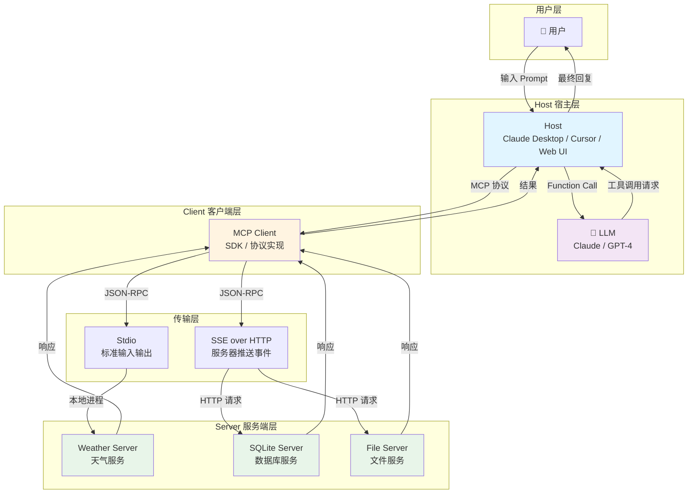
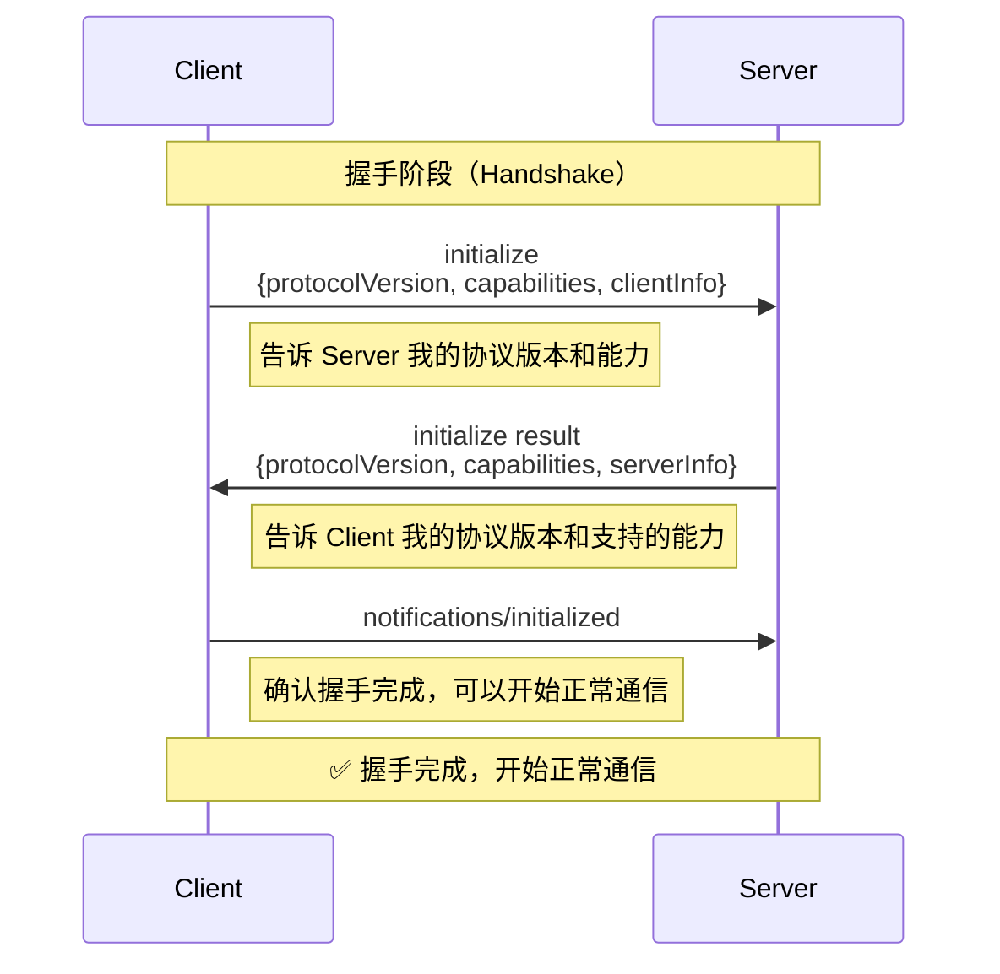
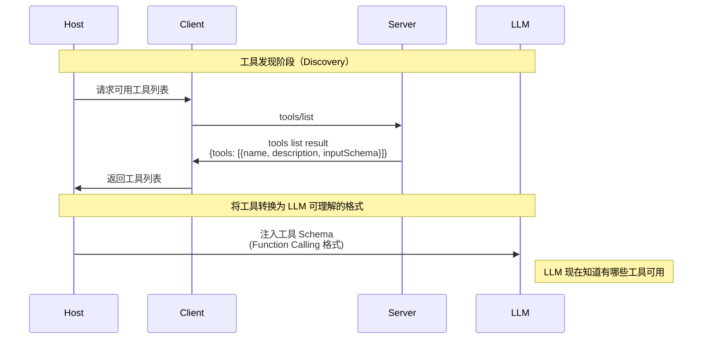
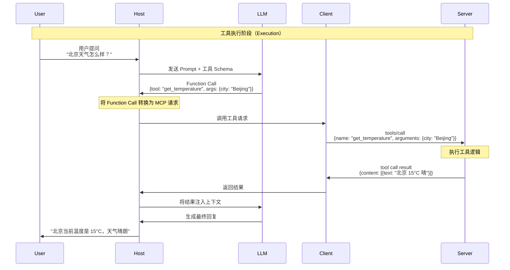
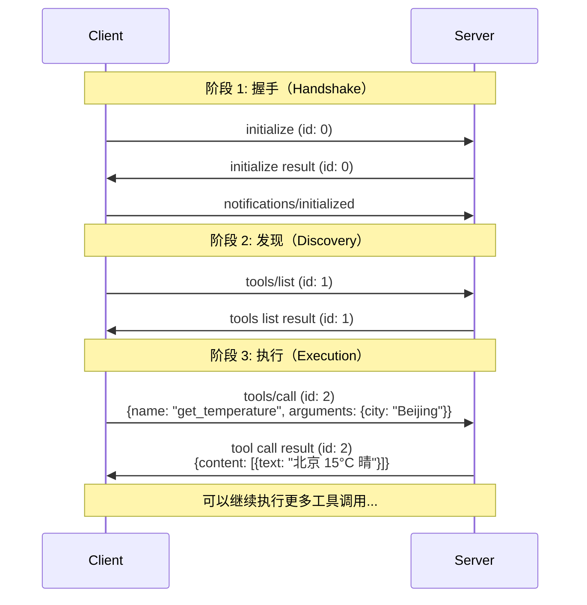
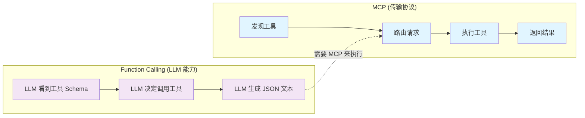
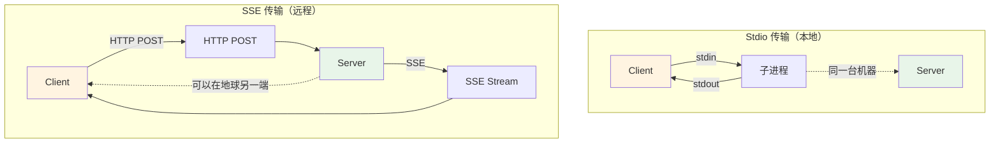

# MCP 架构流程图

本文档包含 MCP 协议的架构图和通信流程图。

## 1. 核心架构图



## 2. 握手流程（Handshake）



## 3. 工具发现流程（Discovery）



## 4. 工具执行流程（Execution）



## 5. 完整通信流程（完整示例）



## 6. MCP vs Function Calling 对比



## 7. Stdio vs SSE 传输对比



## 8. JSON-RPC 消息格式

```mermaid
graph TB
    subgraph "Request 请求"
        R1[jsonrpc: '2.0']
        R2[method: 'tools/call']
        R3[params: {...}]
        R4[id: 1]
        R1 --> R2 --> R3 --> R4
    end

    subgraph "Response 响应"
        RES1[jsonrpc: '2.0']
        RES2[result: {...}]
        RES3[id: 1]
        RES1 --> RES2 --> RES3
    end

    subgraph "Notification 通知"
        N1[jsonrpc: '2.0']
        N2[method: 'notifications/initialized']
        N3[无 id 字段]
        N1 --> N2 --> N3
    end

    style R1 fill:#e1f5ff
    style RES1 fill:#e8f5e9
    style N1 fill:#fff4e1
```

## 关键概念说明

### Host（宿主）
- **定义**：用户直接交互的程序
- **职责**：管理生命周期，聚合 Prompt 和工具，与 LLM 交互

### Client（客户端）
- **定义**：Host 内部的组件，实现 MCP 协议
- **职责**：维持与 Server 的连接，转换 Function Call 为 MCP 请求

### Server（服务端）
- **定义**：能力的提供者
- **职责**：暴露 Tools、Resources、Prompts

### 协议版本
- 当前版本：`2024-11-05`
- 采用日期格式，便于理解版本演进

### 传输方式
- **Stdio**：本地进程通信，零延迟，安全
- **SSE over HTTP**：远程服务，支持分布式部署

---

**最后更新**：2024-01-15
