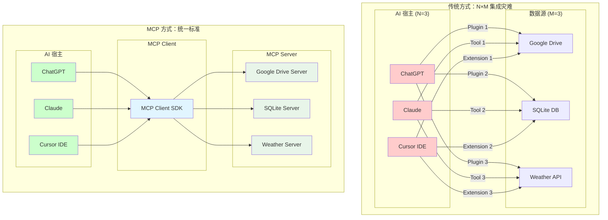
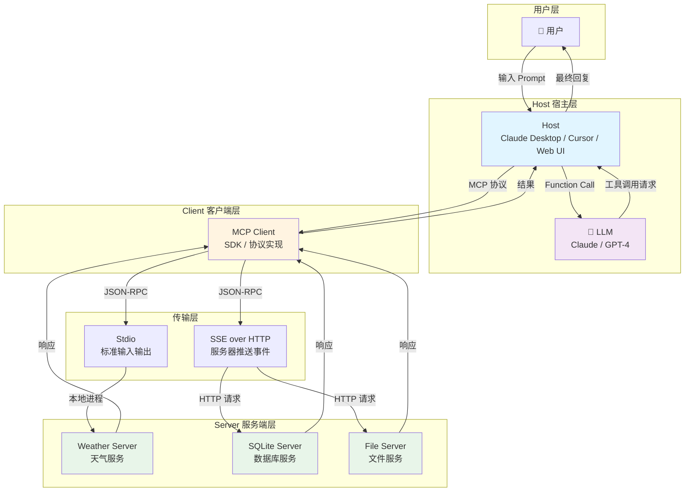
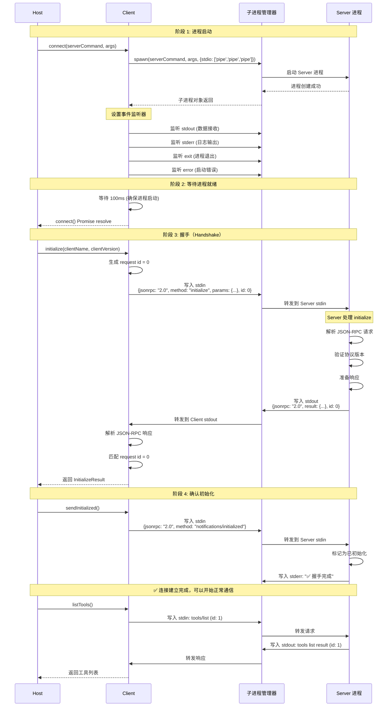
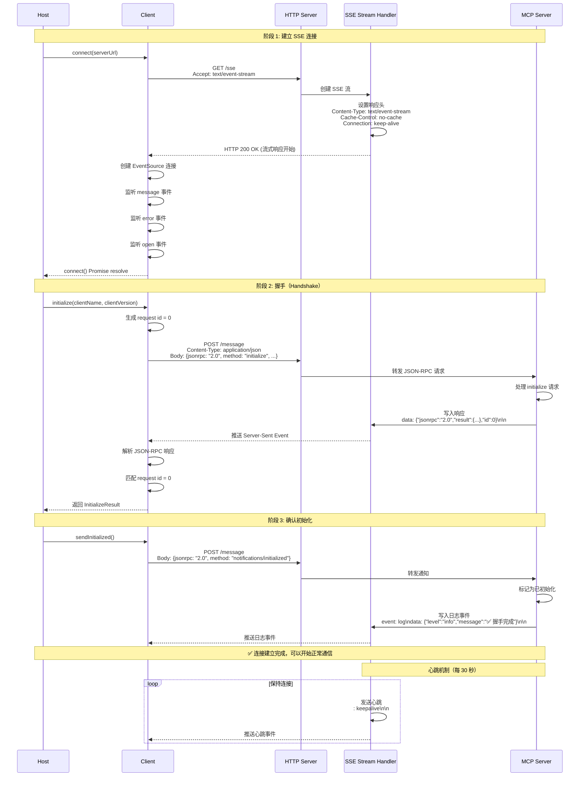
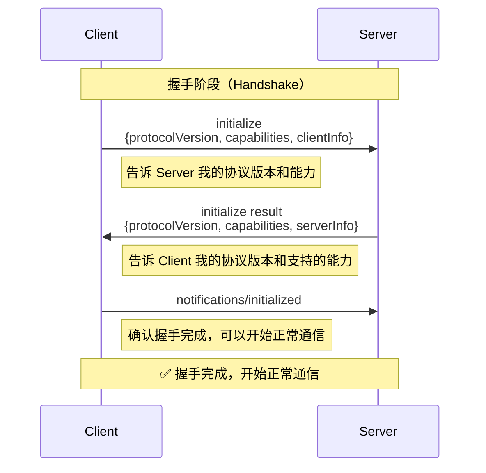
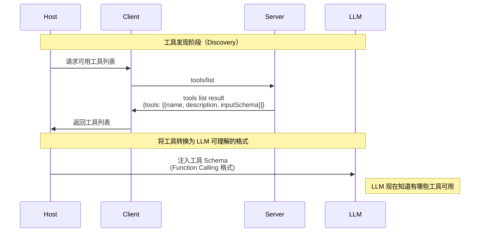
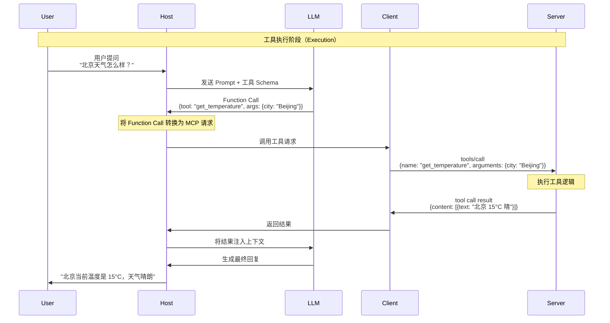
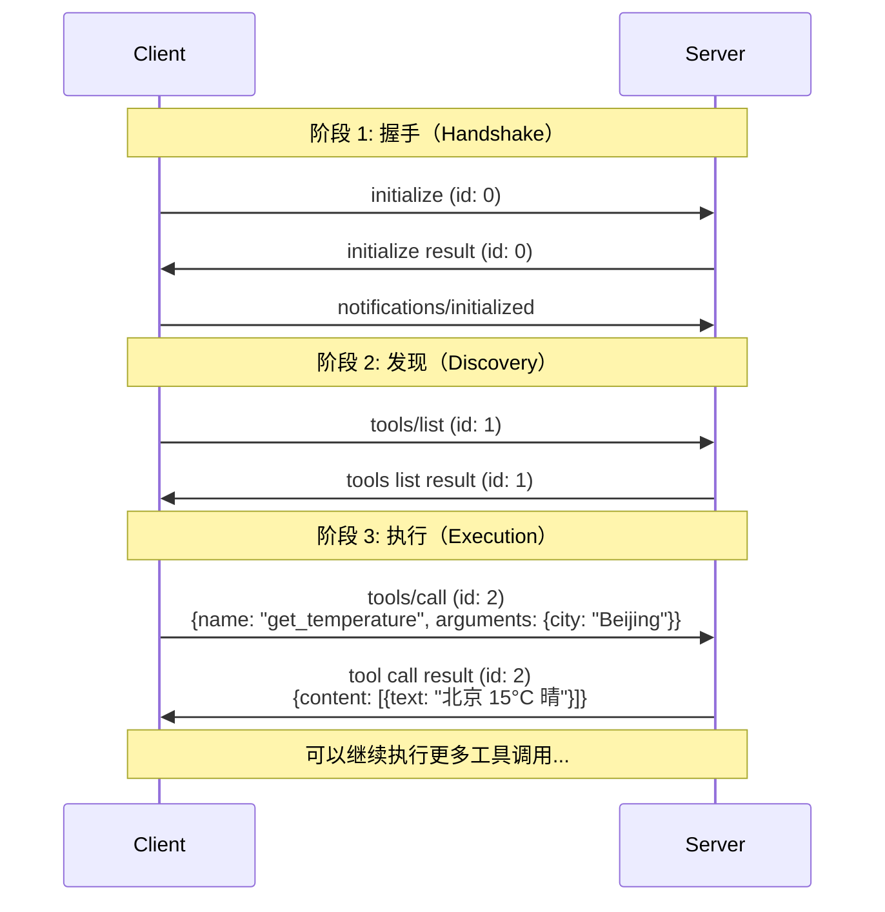
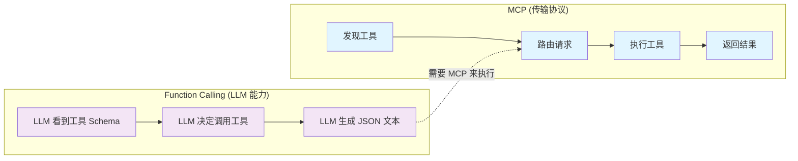
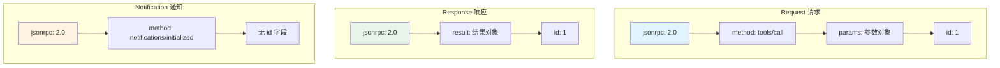

# MCP 架构流程图

本文档包含 MCP 协议的核心架构图和通信流程图。

## 1. 为什么需要 MCP？—— 集成灾难问题

在 MCP 出现之前，AI 应用集成数据源面临严重的碎片化问题：

**问题分析：**
- **传统方式**：需要维护 **N×M = 9 个**连接器（3 个宿主 × 3 个数据源）
- **MCP 方式**：只需要维护 **M = 3 个** Server（每个数据源一个）
- **优势**：Server 只需实现一次 MCP 标准，所有 Host 都能使用

## 2. 核心架构图

## 3. 连接建立完整时序图（Stdio 传输）

> ⭐ **重要**：连接时序图是理解 MCP 协议的核心。这个时序图展示了从进程启动到连接就绪的完整过程。

## 4. 连接建立完整时序图（SSE 传输）

> ⭐ **重要**：SSE 传输与 Stdio 传输的主要区别在于连接建立方式。SSE 使用 HTTP 长连接，支持远程部署。

## 5. 握手流程（简化版）

这是握手流程的简化版本，突出核心步骤：

## 6. 工具发现流程（Discovery）

## 7. 工具执行流程（Execution）

## 8. 完整通信流程（完整示例）

## 9. MCP vs Function Calling 对比

## 10. JSON-RPC 消息格式

## 关键概念说明

### Host（宿主）
- **定义**：用户直接交互的程序
- **职责**：管理生命周期，聚合 Prompt 和工具，与 LLM 交互

### Client（客户端）
- **定义**：Host 内部的组件，实现 MCP 协议
- **职责**：维持与 Server 的连接，转换 Function Call 为 MCP 请求

### Server（服务端）
- **定义**：能力的提供者
- **职责**：暴露 Tools、Resources、Prompts

### 协议版本
- 当前版本：`2024-11-05`
- 采用日期格式，便于理解版本演进

### 传输方式
- **Stdio**：本地进程通信，零延迟，安全
- **SSE over HTTP**：远程服务，支持分布式部署

---

**最后更新**：2024-01-15
