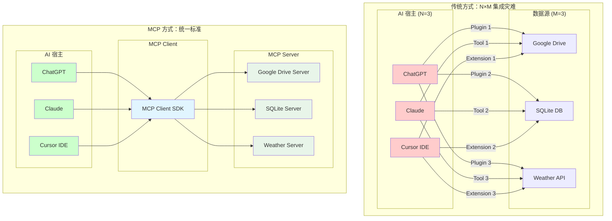
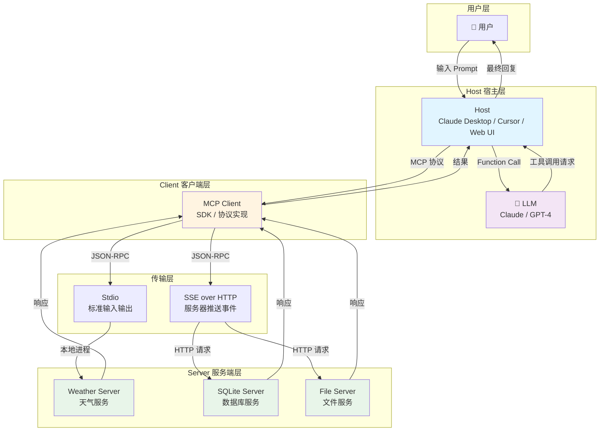
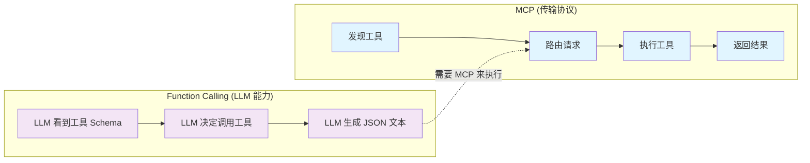
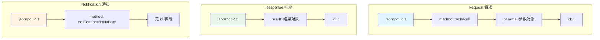
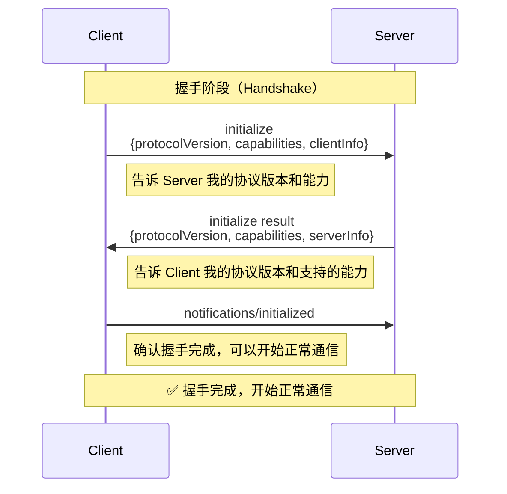
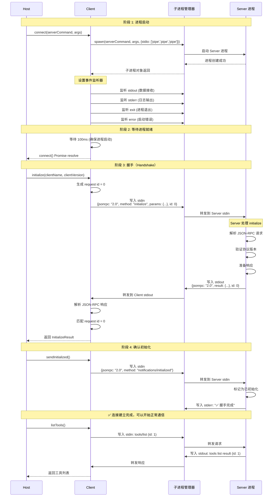
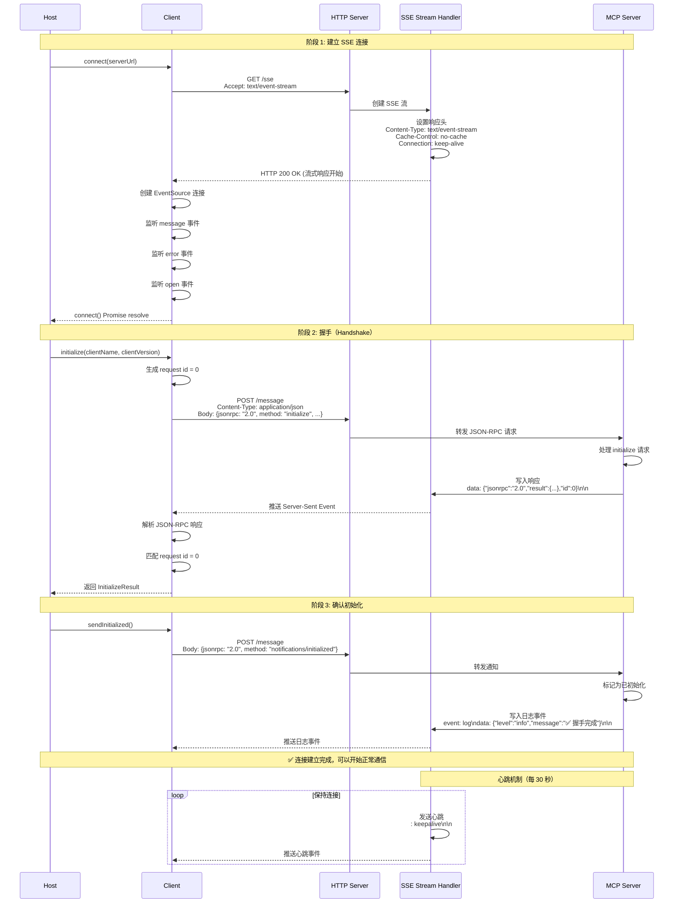
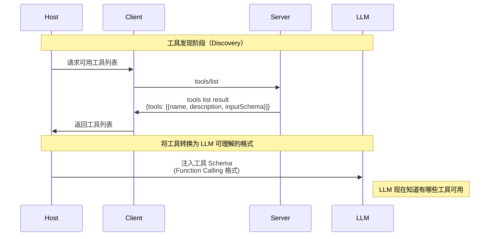
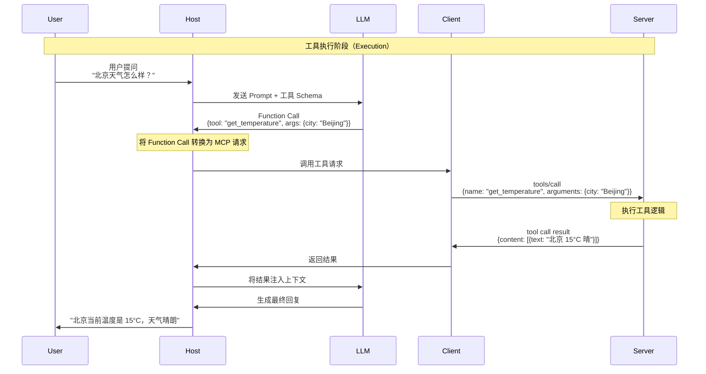
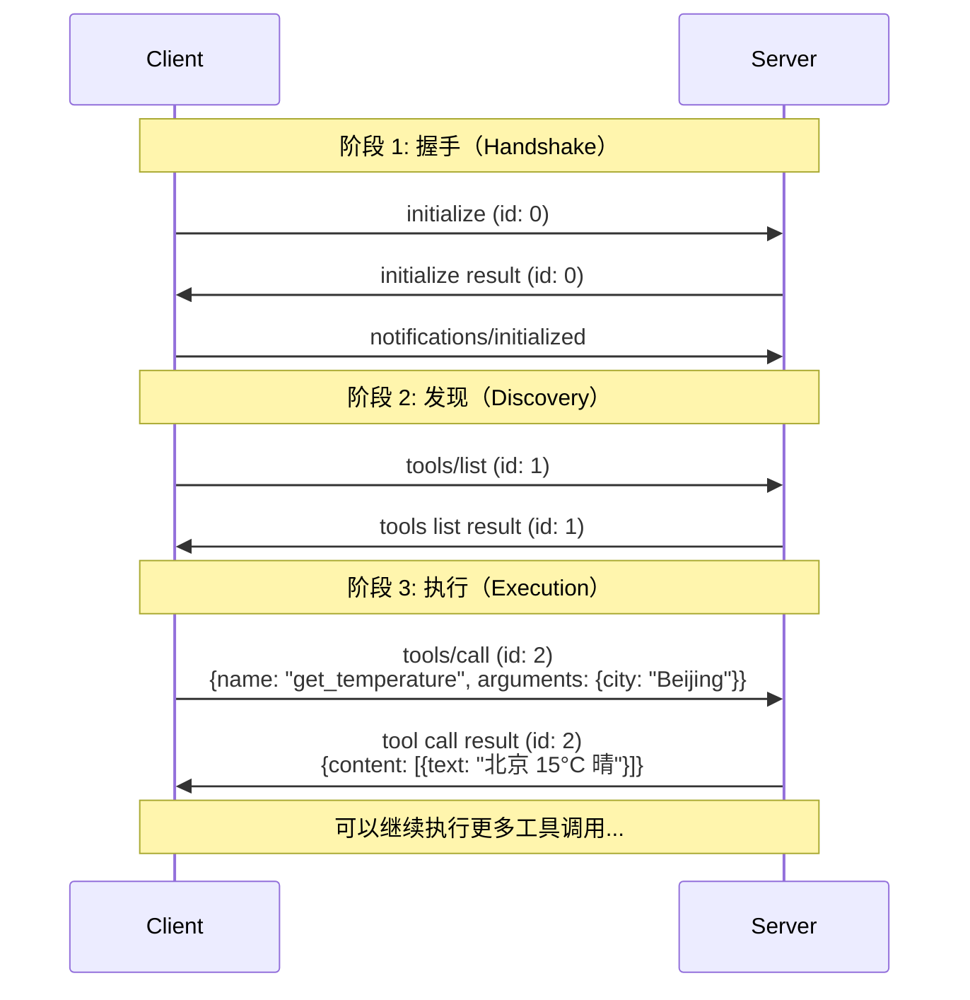

# 第 1 课：协议解构 —— MCP 的架构哲学与通信原理

## 🎯 课程目标 (Learning Objectives)

1. **理解痛点**：能解释 MCP 试图解决的 "集成灾难" 是什么。
2. **厘清架构**：能够画出 Host、Client、Server 三者的关系图，并准确定义各自职责。
3. **区分概念**：彻底搞懂 **MCP (协议)** 与 **Function Calling (LLM能力)** 的区别与联系。
4. **读懂协议**：能看懂底层的 JSON-RPC 消息结构，识别握手（Handshake）与工具调用（Execution）过程。

---

## 📚 课程核心内容

### 第一部分：为什么要创造 MCP？ (The Why)

**1. 以前的世界：碎片化的集成**

* **现象**：如果你想让 ChatGPT 访问 Google Drive，你需要写一个 Plugin；如果你想让 Claude 访问，你又要写一个 Tool；如果你想让 IDE (Cursor) 访问，你还得写一个 Extension。

* **问题：N×M 集成灾难**

  想象一下这个场景：
  
  - **3 个 AI 宿主**：ChatGPT、Claude、Cursor IDE
  - **3 个数据源**：Google Drive、SQLite 数据库、天气 API
  
  传统方式下，你需要开发多少个连接器？
  
  ```
  ChatGPT → Google Drive    (连接器 1)
  ChatGPT → SQLite          (连接器 2)
  ChatGPT → Weather API     (连接器 3)
  Claude  → Google Drive    (连接器 4)
  Claude  → SQLite          (连接器 5)
  Claude  → Weather API     (连接器 6)
  Cursor  → Google Drive    (连接器 7)
  Cursor  → SQLite          (连接器 8)
  Cursor  → Weather API     (连接器 9)
  ```
  
  **答案：3 × 3 = 9 个连接器！**
  
  如果未来有 5 个 AI 宿主和 10 个数据源呢？那就是 **5 × 10 = 50 个连接器**！😱
  
  **更糟糕的是**：
  - 每个连接器都要单独维护和更新
  - 每个连接器的 API 可能都不一样
  - 添加一个新数据源，就要为所有宿主都写一遍
  - 添加一个新宿主，就要为所有数据源都写一遍
  
  > 💡 **生活化比喻**：这就像你要给 3 个不同品牌的手机（iPhone、华为、小米）都配一套充电器、耳机、数据线。每个品牌都要单独买一套，总共需要 9 件配件。而 MCP 就像 USB-C 标准，一个配件所有设备都能用！

* **MCP 的解法**：建立统一标准。Server 只写一次（针对 MCP 标准），所有的 Client（Claude, Cursor, web UI）都能直接用。类似于 **USB 协议** —— 鼠标（Server）不需要知道自己插在 Windows 还是 Mac（Host）上，只要符合 USB 标准就能用。

**集成灾难问题示意图：**



**问题分析：**

让我们用具体数字来对比：

| 场景 | 传统方式 | MCP 方式 | 节省 |
|------|---------|---------|------|
| **3 个宿主 × 3 个数据源** | 需要 9 个连接器 | 需要 3 个 Server | 减少 67% |
| **5 个宿主 × 10 个数据源** | 需要 50 个连接器 | 需要 10 个 Server | 减少 80% |
| **10 个宿主 × 20 个数据源** | 需要 200 个连接器 | 需要 20 个 Server | 减少 90% |

**关键优势：**
- **传统方式**：每增加一个数据源，就要为所有 N 个宿主都写一遍连接器
- **MCP 方式**：每增加一个数据源，只需要写一个 MCP Server，所有宿主自动可用
- **维护成本**：传统方式需要维护 N×M 个代码库，MCP 方式只需要维护 M 个 Server

**实际例子：**

假设你开发了一个"天气查询服务"：

**传统方式**：
```
❌ 需要开发：
  - ChatGPT Plugin（适配 ChatGPT API）
  - Claude Tool（适配 Claude API）
  - Cursor Extension（适配 Cursor API）
  - 未来每个新宿主都要重新开发...
```

**MCP 方式**：
```
✅ 只需要开发：
  - 一个 Weather MCP Server（符合 MCP 标准）
  - 所有宿主（ChatGPT、Claude、Cursor...）自动可用
  - 未来新宿主也无需额外开发
```

### 第二部分：架构拓扑 (The Architecture)

**1. 核心三角色**

* **Host (宿主)**：
  * **定义**：用户直接交互的程序（如 Claude Desktop App, Cursor, 或你自己写的 AI Agent 界面）。
  * **职责**：管理生命周期，负责把用户的 Prompt 和 Client 提供的工具聚合起来发给 LLM。

* **Client (客户端)**：
  * **定义**：Host 内部的一个组件（通常是 SDK），负责维持与 Server 的连接。
  * **职责**：实现了 MCP 协议的一方。它负责发送 `initialize`，负责把 LLM 的 Function Call 转换成 MCP 的 `tools/call` 请求。

* **Server (服务端)**：
  * **定义**：能力的提供者（如 SQLite Server, Fetch Webpage Server）。
  * **职责**：暴露 Tools（工具）、Resources（资源）、Prompts（提示词）。

**核心架构图：**



### 第三部分：关键概念辨析 (The Concept)

**MCP vs. Tool Calling (Function Calling)**

*这是一个很多开发者容易混淆的点，必须讲透。*

* **Tool Calling (LLM 的大脑)**：
  * 这是 **模型** 的能力。LLM 看到一段 JSON Schema 描述（如 `get_weather(city)`），并在输出中决定生成 `{"tool": "get_weather", "args": {"city": "Beijing"}}` 的 JSON 文本。
  * *局限*：LLM 不知道怎么执行它，它只是生成了文本。

* **MCP (神经系统)**：
  * 这是 **传输** 标准。
  * **Step 1 发现**：MCP Client 询问 Server "你有什么工具？"，Server 回复工具列表。
  * **Step 2 注入**：Host 把这些工具转换成 LLM 能看懂的 Schema。
  * **Step 3 执行**：当 LLM 决定调用工具时，Host 通过 MCP Client 将请求通过网络/管道发给 Server 执行，并拿回结果。

> **总结**：MCP 是用来**发现**工具和**路由**执行请求的管道；Tool Calling 是 LLM 决定**使用**工具的认知过程。

**MCP vs Function Calling 对比：**



### 第四部分：协议解剖 (The Protocol)

**1. 传输层 (Transports)**

MCP 支持三种主要的传输方式，每种方式适用于不同的场景：

#### 1.1 Stdio 模式（标准输入输出）

* **适用场景**：
  * 命令行工具集成
  * 进程间通信
  * 本地开发调试
  * IDE 插件集成（如 Cursor、VS Code）

* **工作原理**：
  * Client 启动一个子进程（Server）
  * 通过 `stdin` 发送 JSON-RPC 请求
  * 通过 `stdout` 接收 JSON-RPC 响应
  * 日志输出到 `stderr`（不影响协议通信）

* **优点**：
  * ✅ 零网络延迟
  * ✅ 安全（完全本地）
  * ✅ 实现简单
  * ✅ 适合单客户端场景

* **代码示例**（服务器端）：
```javascript
import { McpServer } from "@modelcontextprotocol/sdk/server/mcp.js";
import { StdioServerTransport } from "@modelcontextprotocol/sdk/server/stdio.js";

const server = new McpServer({
  name: "weather-mcp-server-stdio",
  version: "1.0.0"
});

// 创建 stdio 传输
const transport = new StdioServerTransport();
await server.connect(transport);
```

* **代码示例**（客户端）：
```javascript
import { Client } from "@modelcontextprotocol/sdk/client/index.js";
import { StdioClientTransport } from "@modelcontextprotocol/sdk/client/stdio.js";

  // StdioClientTransport 会自动启动服务器进程
  const transport = new StdioClientTransport({
    command: "node",
    args: ["src/reference/index-stdio.js"]
  });

const client = new Client({
  name: "my-client",
  version: "1.0.0"
});

await client.connect(transport);
```

#### 1.2 HTTP JSON 响应模式

* **适用场景**：
  * 简单的 Web API 集成
  * 传统的请求-响应模式
  * 不需要服务器主动推送的场景

* **工作原理**：
  * 使用 `StreamableHTTPServerTransport`，设置 `enableJsonResponse: true`
  * 客户端发送 HTTP POST 请求
  * 服务器立即返回 JSON 响应
  * 类似传统的 REST API

* **优点**：
  * ✅ 简单直接，类似传统 REST API
  * ✅ 每个请求立即返回完整响应
  * ✅ 易于集成到现有 Web 应用

* **缺点**：
  * ❌ 不支持服务器主动推送
  * ❌ 不支持流式传输

* **代码示例**（服务器端）：
```javascript
import { StreamableHTTPServerTransport } from "@modelcontextprotocol/sdk/server/streamableHttp.js";

const transport = new StreamableHTTPServerTransport({
  sessionIdGenerator: undefined,
  enableJsonResponse: true  // 👈 启用 JSON 响应模式
});

app.post("/mcp", async (req, res) => {
  await server.connect(transport);
  await transport.handleRequest(req, res, req.body);
});
```

#### 1.3 SSE 流式模式（Server-Sent Events）

* **适用场景**：
  * 需要服务器主动推送消息
  * 实时进度更新
  * 长时间运行的异步操作
  * 流式传输数据

* **工作原理**：
  * 使用 `StreamableHTTPServerTransport`，设置 `enableJsonResponse: false`
  * 客户端通过 GET 请求建立 SSE 连接
  * 客户端通过 POST 请求发送消息
  * 服务器通过 SSE 流推送响应和通知

* **优点**：
  * ✅ 支持服务器主动推送消息
  * ✅ 支持流式传输（实时进度更新）
  * ✅ 支持长时间运行的异步操作
  * ✅ 支持多个响应消息（如进度通知）

* **缺点**：
  * ❌ 需要客户端支持 SSE
  * ❌ 实现相对复杂
  * ❌ 需要管理 Session

* **代码示例**（服务器端）：
```javascript
import { StreamableHTTPServerTransport } from "@modelcontextprotocol/sdk/server/streamableHttp.js";
import { randomUUID } from "node:crypto";

// GET 端点：建立 SSE 连接
app.get("/mcp", async (req, res) => {
  const transport = new StreamableHTTPServerTransport({
    sessionIdGenerator: () => randomUUID(),
    enableJsonResponse: false  // 👈 SSE 模式
  });
  
  await server.connect(transport);
  await transport.handleRequest(req, res);
});

// POST 端点：发送消息（响应通过 SSE 推送）
app.post("/mcp", async (req, res) => {
  const sessionId = req.headers['mcp-session-id'];
  const transport = transports.get(sessionId);
  
  await transport.handleRequest(req, res, req.body);
});
```

* **代码示例**（客户端）：
```javascript
import { StreamableHTTPClientTransport } from "@modelcontextprotocol/sdk/client/streamableHttp.js";

// 创建 Streamable HTTP 传输（支持 SSE）
const transport = new StreamableHTTPClientTransport(new URL("http://localhost:3001/mcp"));

// 监听传输层的消息（接收 SSE 推送）
transport.onmessage = (message) => {
  if (message.method === 'notifications/message') {
    const { level, data } = message.params || {};
    console.log(`[${level}] ${data}`);
  }
};

const client = new Client({
  name: "my-client",
  version: "1.0.0"
});

await client.connect(transport);
```

**三种模式对比：**

| 特性 | Stdio 模式 | HTTP JSON 模式 | SSE 流式模式 |
|------|-----------|---------------|-------------|
| 通信方式 | stdin/stdout | HTTP POST | HTTP GET + SSE |
| 适用场景 | 命令行、IDE 插件 | Web API | Web 实时应用 |
| 服务器推送 | ✅ 支持 | ❌ 不支持 | ✅ 支持 |
| 流式传输 | ✅ 支持 | ❌ 不支持 | ✅ 支持 |
| 连接管理 | 进程生命周期 | 无状态 | Session 管理 |
| 复杂度 | 简单 | 简单 | 较复杂 |
| 延迟 | 最低 | 低 | 中等 |

**设计哲学**：为什么 SSE 而不是 WebSocket？

MCP 官方选择 HTTP POST + SSE 而不是 WebSocket 的原因：
- ✅ 更符合 RESTful 语义
- ✅ 更容易被防火墙和网关处理
- ✅ 支持 HTTP/2 和 HTTP/3
- ✅ 浏览器原生支持，无需额外库

**2. 消息格式：JSON-RPC 2.0**

* 所有的通信都是标准的 JSON-RPC 消息。
* **Request (请求)**: `{ "jsonrpc": "2.0", "method": "...", "params": {...}, "id": 1 }`
* **Response (响应)**: `{ "jsonrpc": "2.0", "result": {...}, "id": 1 }`

**JSON-RPC 消息格式：**



**3. 握手流程 (The Handshake)**

这是连接建立的第一步，必须掌握：

1. **Client 发送 `initialize`**：
   * 告诉 Server：我的协议版本是 `2024-11-05`，我的 Client 名字叫 `Claude`。

2. **Server 响应 Result**：
   * 告诉 Client：我的协议版本是 `2024-11-05`，我支持的能力有 `tools`, `resources`。

3. **Client 发送 `notifications/initialized`**：
   * 确认握手完成，开始正常通信。

**握手流程（简化版）：**



**4. 工具实现示例**

下面是一个完整的工具实现示例，展示如何创建和注册 MCP 工具：

```javascript
import { z } from "zod";

// 工具定义
export const getWeatherTool = {
  name: "getWeather",
  definition: {
    title: "Get Weather",
    description: "获取指定城市的天气信息。支持的城市：成都、北京",
    inputSchema: {
      city: z.string().min(1)
    }
  },
  handler: async (args, extra) => {
    const { city } = args;
    const server = extra?.server;
    const sessionId = extra?.sessionId;

    // 如果服务器支持日志推送，发送进度消息
    if (server && sessionId) {
      try {
        await server.sendLoggingMessage({
          level: 'info',
          data: `正在查询 ${city} 的天气信息...`
        }, sessionId);
      } catch (error) {
        // 忽略推送失败，不影响主要功能
      }
    }

    // 模拟查询延迟
    await new Promise(resolve => setTimeout(resolve, 500));

    // 返回天气信息
    const weather = {
      city: city,
      temperature: "22°C",
      condition: "多云",
      humidity: "65%",
      timestamp: new Date().toISOString()
    };

    return {
      content: [{
        type: "text",
        text: JSON.stringify(weather, null, 2)
      }]
    };
  }
};

// 注册工具
server.registerTool(
  getWeatherTool.name,
  getWeatherTool.definition,
  getWeatherTool.handler
);
```

**关键点：**
- **工具定义**：包含名称、描述和输入 Schema（使用 Zod 验证）
- **工具处理器**：接收参数和额外信息（extra），返回内容数组
- **服务器推送**：通过 `server.sendLoggingMessage()` 发送进度消息（需要 SSE 模式）
- **错误处理**：返回 `isError: true` 表示工具执行失败

**5. MCP 协议方法列表**

MCP 2024-11-05 协议共定义了 **16+ 个方法**，按功能分类如下：

| 方法名 | 类型 | 方向 | 用途 |
|--------|------|------|------|
| **基础生命周期** |
| `initialize` | 请求 | Client → Server | 初始化会话，协商协议版本和能力 |
| `notifications/initialized` | 通知 | Client → Server | 握手完成，通知 Server 已准备好 |
| **Tools（工具）** |
| `tools/list` | 请求 | Client → Server | 获取 Server 提供的所有工具列表 |
| `tools/call` | 请求 | Client → Server | 调用指定的工具，传入参数 |
| `notifications/tools/list_changed` | 通知 | Server → Client | 工具列表发生变化时通知 Client |
| **Resources（资源）** |
| `resources/list` | 请求 | Client → Server | 列出可用的直接资源 |
| `resources/templates/list` | 请求 | Client → Server | 列出资源模板（参数化的 URI 模板） |
| `resources/read` | 请求 | Client → Server | 读取指定 URI 的资源内容 |
| `resources/subscribe` | 请求 | Client → Server | 订阅资源变化 |
| **Prompts（提示词）** |
| `prompts/list` | 请求 | Client → Server | 列出可用的提示词模板 |
| `prompts/get` | 请求 | Client → Server | 获取指定的提示词（可填充参数） |
| `notifications/prompts/list_changed` | 通知 | Server → Client | 提示词列表发生变化时通知 Client |
| **Roots（根目录）** |
| `roots/list` | 请求 | Server → Client | Server 请求 Client 提供文件系统根目录列表 |
| `notifications/roots/list_changed` | 通知 | Client → Server | 根目录列表发生变化时通知 Server |
| **Sampling（采样）** |
| `sampling/createMessage` | 请求 | Server → Client | Server 请求 Client 生成模型响应 |
| **Utilities（工具类）** |
| `completion/complete` | 请求 | Client → Server | 参数自动补全 |

**说明：**
- **类型**：请求（Request）需要响应，通知（Notification）不需要响应
- **方向**：表示消息的发送方向

> 💡 **提示**：本课程重点讲解核心的 4 个方法（`initialize`、`notifications/initialized`、`tools/list`、`tools/call`），这些方法足以演示完整的 MCP 通信流程。其他方法的使用方式类似，可以参考 [MCP 官方文档](https://modelcontextprotocol.io/specification/2024-11-05/)。

---

## 📊 架构图与流程图

本课程提供了核心的可视化图表，帮助理解 MCP 协议。以下是详细的架构图和流程图：

### 🔗 连接时序图（重点推荐）

> ⭐ **重要**：连接时序图是理解 MCP 协议的核心。这些时序图展示了从进程启动到连接就绪的完整过程。

#### 1. 连接建立完整时序图（Stdio 传输）



#### 2. 连接建立完整时序图（SSE 传输）

> ⭐ **重要**：SSE 传输与 Stdio 传输的主要区别在于连接建立方式。SSE 使用 HTTP 长连接，支持远程部署。



### 📐 工具发现与执行流程

#### 3. 工具发现流程（Discovery）



#### 4. 工具执行流程（Execution）



#### 5. 完整通信流程（完整示例）



> 💡 **学习建议**：
> - **首先学习连接时序图**（第 1-2 节），这是理解 MCP 协议的基础
> - 然后对照代码实现（参考 `mcp_demo` 项目）理解具体实现细节
> - 运行三种传输模式的示例代码，观察实际的连接过程
> - 对比不同传输模式的特点和适用场景

---

## 🛠️ 课后实战产出 (Deliverable)

**任务名称：人肉协议分析器 (The Human Protocol Analyzer)**

**背景**：
你截获了一段 MCP Client 和 Server 之间的 Stdio 通信日志。请阅读下面的原始 JSON 日志，并回答三个问题。

**原始日志：**
```json
// [Line 1]
{
  "jsonrpc": "2.0",
  "method": "initialize",
  "params": {
    "protocolVersion": "2024-11-05",
    "capabilities": { "roots": { "listChanged": true } },
    "clientInfo": { "name": "MyMCPClient", "version": "1.0" }
  },
  "id": 0
}
// [Line 2]
{
  "jsonrpc": "2.0",
  "id": 0,
  "result": {
    "protocolVersion": "2024-11-05",
    "capabilities": { "tools": { "listChanged": true } },
    "serverInfo": { "name": "WeatherServer", "version": "0.1" }
  }
}
// [Line 3]
{
  "jsonrpc": "2.0",
  "method": "notifications/initialized"
}
// [Line 4]
{
  "jsonrpc": "2.0",
  "method": "tools/list",
  "id": 1
}
// [Line 5]
{
  "jsonrpc": "2.0",
  "id": 1,
  "result": {
    "tools": [
      {
        "name": "get_temperature",
        "description": "Get current temperature",
        "inputSchema": {
          "type": "object",
          "properties": { "city": { "type": "string" } }
        }
      }
    ]
  }
}
```

**作业问题（学员需完成）：**

1. **握手分析**：哪几行代码构成了完整的握手过程？
2. **能力识别**：根据 Line 2，这个 Server 支持哪些核心原语（Primitives）？它支持 Resources 吗？
3. **流程理解**：在 Line 5 之后，如果 LLM 想要查询北京的天气，Client 接下来应该发送什么样的 JSON 包？（请尝试手写出这个 JSON Request）。

**作业解答（参考）**：

* Q1: Line 1, 2, 3。
* Q2: 只支持 `tools`，不支持 `resources` 或 `prompts`（因为 capabilities 里没写）。
* Q3: 需要构造一个 `tools/call` 请求。
```json
{
  "jsonrpc": "2.0",
  "method": "tools/call",
  "params": {
    "name": "get_temperature",
    "arguments": { "city": "Beijing" }
  },
  "id": 2
}
```

---

## 🚀 快速开始

### 安装依赖

```bash
npm install
```

### 运行示例

本课程提供了三种传输模式的完整示例，帮助你理解 MCP 协议的实际应用。

#### 1. Stdio 模式示例（推荐入门）

Stdio 模式是最简单的传输方式，适合本地开发和调试。

**启动服务器：**
```bash
# 方式 1: 使用 npm 脚本
npm run start:stdio

# 方式 2: 直接运行
node src/reference/index-stdio.js
```

**运行测试客户端：**
```bash
# 在另一个终端运行
npm run test:stdio
# 或
node test-stdio-client.js
```

**注意**：测试客户端会自动启动服务器进程（`src/reference/index-stdio.js`）。

**特点：**
- ✅ 最简单的实现方式
- ✅ 零网络延迟
- ✅ 适合单客户端场景
- ✅ 支持服务器主动推送消息

#### 2. HTTP JSON 响应模式示例

HTTP JSON 模式适合简单的 Web API 集成。

**启动服务器：**
```bash
# 方式 1: 使用 npm 脚本
npm start

# 方式 2: 直接运行
node src/reference/index.js

# 方式 3: 使用环境变量
ENABLE_SSE=false node src/reference/index.js
```

**测试 API：**
```bash
# 使用 curl 测试
curl -X POST http://localhost:3000/mcp \
  -H "Content-Type: application/json" \
  -d '{
    "jsonrpc": "2.0",
    "method": "tools/call",
    "params": {
      "name": "getWeather",
      "arguments": {
        "city": "成都"
      }
    },
    "id": 1
  }'
```

**特点：**
- ✅ 简单直接，类似传统 REST API
- ✅ 每个请求立即返回完整响应
- ✅ 易于集成到现有 Web 应用
- ❌ 不支持服务器主动推送

#### 3. SSE 流式模式示例（高级）

SSE 模式支持服务器主动推送和流式传输，适合实时应用。

**启动服务器：**
```bash
# 方式 1: 使用 npm 脚本
npm run start:sse

# 方式 2: 使用命令行参数
node src/reference/index.js --sse

# 方式 3: 使用环境变量
ENABLE_SSE=true node src/reference/index.js
```

**运行测试客户端：**
```bash
# 在另一个终端运行
npm run test:sse
# 或
node test-sse-client.js
```

**特点：**
- ✅ 支持服务器主动推送消息
- ✅ 支持流式传输（实时进度更新）
- ✅ 支持长时间运行的异步操作
- ✅ 支持多个响应消息（如进度通知）

**SSE 连接流程：**
1. 客户端发送 GET 请求建立 SSE 连接
2. 服务器返回 session ID
3. 客户端通过 POST 请求发送消息（携带 session ID）
4. 服务器通过 SSE 流推送响应和通知

### 参考代码

本课程提供了完整的三种传输模式实现，代码位于 `src/reference/` 目录：

- **Stdio 模式**：`src/reference/index-stdio.js`
- **HTTP JSON 模式**：`src/reference/index.js` (默认模式)
- **SSE 流式模式**：`src/reference/index.js --sse`
- **工具实现**：`src/reference/tools/` 目录
  - `getWeather.js` - 基础天气查询工具
  - `getWeatherSSE.js` - 展示 SSE 推送特性的工具

### 工具说明

课程示例提供了两个工具：

1. **`getWeather`**：基础天气查询工具
   - 支持所有传输模式
   - 返回完整的天气信息

2. **`getWeatherSSE`**：展示 SSE 推送特性的工具
   - 仅支持 SSE 模式
   - 分步骤推送天气信息的各个部分
   - 展示服务器主动推送能力

---

## 📁 项目结构

```
L05 MCP 协议解构/
├── README.md                 # 本文件（课程内容）
├── QUICKSTART.md             # 快速开始指南
├── package.json              # 项目配置
├── tsconfig.json             # TypeScript 配置
├── test-stdio-client.js      # Stdio 模式测试客户端
├── test-sse-client.js        # SSE 模式测试客户端
├── src/
│   ├── types/                # MCP 协议类型定义
│   │   └── mcp.ts
│   ├── server/               # MCP Server 实现（TypeScript）
│   │   ├── weather-server.ts # 天气服务示例
│   │   └── index.ts
│   ├── client/               # MCP Client 实现（TypeScript）
│   │   ├── stdio-client.ts   # Stdio 传输层
│   │   └── index.ts
│   ├── examples/             # 示例代码（TypeScript）
│   │   ├── protocol-analyzer.ts  # 协议分析器
│   │   └── interactive-demo.ts   # 交互式演示
│   └── reference/            # 参考实现（JavaScript，来自 mcp_demo）
│       ├── index.js          # HTTP/SSE 服务器
│       ├── index-stdio.js    # Stdio 服务器
│       └── tools/            # 工具实现
│           ├── index.js
│           ├── getWeather.js
│           └── getWeatherSSE.js
└── logs/                     # 通信日志（运行时生成）
```

---

## 🎓 讲师备课提示 (Instructor Notes)

1. **关于 Stdio vs SSE**：这里可以做一个生动的比喻。Stdio 就像是**连体婴**，Server 就在 Client 肚子里（子进程）；SSE 就像是**打电话**，Server 可以在地球另一端。

2. **关于 JSON-RPC**：强调一下 `id` 的作用。因为是异步通信，Client 可能同时发 10 个请求，必须靠 `id` 才能知道哪个 Response 对应哪个 Request。

3. **关于协议版本**：`2024-11-05` 是 MCP 的协议版本号，采用日期格式，便于理解版本演进。

---

## 📖 参考资料

- [MCP 官方文档](https://modelcontextprotocol.io/)
- [JSON-RPC 2.0 规范](https://www.jsonrpc.org/specification)
- [Server-Sent Events (SSE) 规范](https://developer.mozilla.org/en-US/docs/Web/API/Server-sent_events)

---

## 🔑 关键概念说明

### Host（宿主）
- **定义**：用户直接交互的程序
- **职责**：管理生命周期，聚合 Prompt 和工具，与 LLM 交互

### Client（客户端）
- **定义**：Host 内部的组件，实现 MCP 协议
- **职责**：维持与 Server 的连接，转换 Function Call 为 MCP 请求

### Server（服务端）
- **定义**：能力的提供者
- **职责**：暴露 Tools、Resources、Prompts

### 协议版本
- 当前版本：`2024-11-05`
- 采用日期格式，便于理解版本演进

### 传输方式
- **Stdio**：本地进程通信，零延迟，安全
- **SSE over HTTP**：远程服务，支持分布式部署

---

**最后更新**：2024-01-15
