# 第 1 课：协议解构 —— MCP 的架构哲学与通信原理

## 🎯 课程目标 (Learning Objectives)

1. **理解痛点**：能解释 MCP 试图解决的 "集成灾难" 是什么。
2. **厘清架构**：能够画出 Host、Client、Server 三者的关系图，并准确定义各自职责。
3. **区分概念**：彻底搞懂 **MCP (协议)** 与 **Function Calling (LLM能力)** 的区别与联系。
4. **读懂协议**：能看懂底层的 JSON-RPC 消息结构，识别握手（Handshake）与工具调用（Execution）过程。

---

## 📚 课程核心内容

### 第一部分：为什么要创造 MCP？ (The Why)

**1. 以前的世界：碎片化的集成**

* **现象**：如果你想让 ChatGPT 访问 Google Drive，你需要写一个 Plugin；如果你想让 Claude 访问，你又要写一个 Tool；如果你想让 IDE (Cursor) 访问，你还得写一个 Extension。
* **问题**：如果有 N 个 AI 模型宿主，和 M 个数据源，开发者需要维护 N×M 个连接器。
* **MCP 的解法**：建立统一标准。Server 只写一次（针对 MCP 标准），所有的 Client（Claude, Cursor, web UI）都能直接用。类似于 **USB 协议** —— 鼠标（Server）不需要知道自己插在 Windows 还是 Mac（Host）上，只要符合 USB 标准就能用。

**集成灾难问题示意图：**


**问题分析：**
- **传统方式**：需要维护 **N×M = 9 个**连接器（3 个宿主 × 3 个数据源）
- **MCP 方式**：只需要维护 **M = 3 个** Server（每个数据源一个）
- **优势**：Server 只需实现一次 MCP 标准，所有 Host 都能使用

### 第二部分：架构拓扑 (The Architecture)

**1. 核心三角色**

* **Host (宿主)**：
  * **定义**：用户直接交互的程序（如 Claude Desktop App, Cursor, 或你自己写的 AI Agent 界面）。
  * **职责**：管理生命周期，负责把用户的 Prompt 和 Client 提供的工具聚合起来发给 LLM。

* **Client (客户端)**：
  * **定义**：Host 内部的一个组件（通常是 SDK），负责维持与 Server 的连接。
  * **职责**：实现了 MCP 协议的一方。它负责发送 `initialize`，负责把 LLM 的 Function Call 转换成 MCP 的 `tools/call` 请求。

* **Server (服务端)**：
  * **定义**：能力的提供者（如 SQLite Server, Fetch Webpage Server）。
  * **职责**：暴露 Tools（工具）、Resources（资源）、Prompts（提示词）。

**核心架构图：**

```mermaid
graph TB
    subgraph "用户层"
        User[👤 用户]
    end

    subgraph "Host 宿主层"
        Host[Host<br/>Claude Desktop / Cursor / Web UI]
        LLM[🧠 LLM<br/>Claude / GPT-4]
    end

    subgraph "Client 客户端层"
        Client[MCP Client<br/>SDK / 协议实现]
    end

    subgraph "传输层"
        Stdio[Stdio<br/>标准输入输出]
        SSE[SSE over HTTP<br/>服务器推送事件]
    end

    subgraph "Server 服务端层"
        Server1[Weather Server<br/>天气服务]
        Server2[SQLite Server<br/>数据库服务]
        Server3[File Server<br/>文件服务]
    end

    User -->|输入 Prompt| Host
    Host -->|Function Call| LLM
    LLM -->|工具调用请求| Host
    Host -->|MCP 协议| Client
    Client -->|JSON-RPC| Stdio
    Client -->|JSON-RPC| SSE
    Stdio -->|本地进程| Server1
    SSE -->|HTTP 请求| Server2
    SSE -->|HTTP 请求| Server3
    Server1 -->|响应| Client
    Server2 -->|响应| Client
    Server3 -->|响应| Client
    Client -->|结果| Host
    Host -->|最终回复| User

    style Host fill:#e1f5ff
    style Client fill:#fff4e1
    style Server1 fill:#e8f5e9
    style Server2 fill:#e8f5e9
    style Server3 fill:#e8f5e9
    style LLM fill:#f3e5f5
```



### 第三部分：关键概念辨析 (The Concept)

**MCP vs. Tool Calling (Function Calling)**

*这是一个很多开发者容易混淆的点，必须讲透。*

* **Tool Calling (LLM 的大脑)**：
  * 这是 **模型** 的能力。LLM 看到一段 JSON Schema 描述（如 `get_weather(city)`），并在输出中决定生成 `{"tool": "get_weather", "args": {"city": "Beijing"}}` 的 JSON 文本。
  * *局限*：LLM 不知道怎么执行它，它只是生成了文本。

* **MCP (神经系统)**：
  * 这是 **传输** 标准。
  * **Step 1 发现**：MCP Client 询问 Server "你有什么工具？"，Server 回复工具列表。
  * **Step 2 注入**：Host 把这些工具转换成 LLM 能看懂的 Schema。
  * **Step 3 执行**：当 LLM 决定调用工具时，Host 通过 MCP Client 将请求通过网络/管道发给 Server 执行，并拿回结果。

> **总结**：MCP 是用来**发现**工具和**路由**执行请求的管道；Tool Calling 是 LLM 决定**使用**工具的认知过程。

**MCP vs Function Calling 对比：**

```mermaid
graph LR
    subgraph "Function Calling (LLM 能力)"
        FC1[LLM 看到工具 Schema]
        FC2[LLM 决定调用工具]
        FC3[LLM 生成 JSON 文本]
        FC1 --> FC2 --> FC3
    end

    subgraph "MCP (传输协议)"
        MCP1[发现工具]
        MCP2[路由请求]
        MCP3[执行工具]
        MCP4[返回结果]
        MCP1 --> MCP2 --> MCP3 --> MCP4
    end

    FC3 -.->|"需要 MCP 来执行"| MCP2

    style FC1 fill:#f3e5f5
    style FC2 fill:#f3e5f5
    style FC3 fill:#f3e5f5
    style MCP1 fill:#e1f5ff
    style MCP2 fill:#e1f5ff
    style MCP3 fill:#e1f5ff
    style MCP4 fill:#e1f5ff
```



### 第四部分：协议解剖 (The Protocol)

**1. 传输层 (Transports)**

* **Stdio (Standard Input/Output)**：
  * **场景**：本地 Agent。
  * **原理**：Client 启动一个子进程（Server），通过 `stdin` 发送 JSON，通过 `stdout` 接收 JSON。
  * **优点**：零网络延迟，安全（完全本地），简单。

* **SSE (Server-Sent Events) over HTTP**：
  * **场景**：远程服务、分布式部署。
  * **原理**：
    * Server -> Client：使用 SSE 建立长连接推送消息（适合流式传输）。
    * Client -> Server：使用标准 HTTP POST 发送请求。
  * **设计哲学**：为什么不是 WebSocket？MCP 官方认为 HTTP POST + SSE 更符合 RESTful 语义，更容易被防火墙和网关处理。

**2. 消息格式：JSON-RPC 2.0**

* 所有的通信都是标准的 JSON-RPC 消息。
* **Request (请求)**: `{ "jsonrpc": "2.0", "method": "...", "params": {...}, "id": 1 }`
* **Response (响应)**: `{ "jsonrpc": "2.0", "result": {...}, "id": 1 }`

**JSON-RPC 消息格式：**

```mermaid
graph TB
    subgraph "Request 请求"
        R1["jsonrpc: 2.0"]
        R2["method: tools/call"]
        R3["params: 参数对象"]
        R4["id: 1"]
        R1 --> R2 --> R3 --> R4
    end

    subgraph "Response 响应"
        RES1["jsonrpc: 2.0"]
        RES2["result: 结果对象"]
        RES3["id: 1"]
        RES1 --> RES2 --> RES3
    end

    subgraph "Notification 通知"
        N1["jsonrpc: 2.0"]
        N2["method: notifications/initialized"]
        N3["无 id 字段"]
        N1 --> N2 --> N3
    end

    style R1 fill:#e1f5ff
    style RES1 fill:#e8f5e9
    style N1 fill:#fff4e1
```



**3. 握手流程 (The Handshake)**

这是连接建立的第一步，必须掌握：

1. **Client 发送 `initialize`**：
   * 告诉 Server：我的协议版本是 `2024-11-05`，我的 Client 名字叫 `Claude`。

2. **Server 响应 Result**：
   * 告诉 Client：我的协议版本是 `2024-11-05`，我支持的能力有 `tools`, `resources`。

3. **Client 发送 `notifications/initialized`**：
   * 确认握手完成，开始正常通信。

**握手流程（简化版）：**

```mermaid
sequenceDiagram
    participant C as Client
    participant S as Server

    Note over C,S: 握手阶段（Handshake）

    C->>S: initialize<br/>{protocolVersion, capabilities, clientInfo}
    Note right of C: 告诉 Server 我的协议版本和能力

    S->>C: initialize result<br/>{protocolVersion, capabilities, serverInfo}
    Note left of S: 告诉 Client 我的协议版本和支持的能力

    C->>S: notifications/initialized
    Note right of C: 确认握手完成，可以开始正常通信

    Note over C,S: ✅ 握手完成，开始正常通信
```



**4. MCP 协议方法列表**

MCP 2024-11-05 协议共定义了 **16+ 个方法**，按功能分类如下：

| 方法名 | 类型 | 方向 | 用途 |
|--------|------|------|------|
| **基础生命周期** |
| `initialize` | 请求 | Client → Server | 初始化会话，协商协议版本和能力 |
| `notifications/initialized` | 通知 | Client → Server | 握手完成，通知 Server 已准备好 |
| **Tools（工具）** |
| `tools/list` | 请求 | Client → Server | 获取 Server 提供的所有工具列表 |
| `tools/call` | 请求 | Client → Server | 调用指定的工具，传入参数 |
| `notifications/tools/list_changed` | 通知 | Server → Client | 工具列表发生变化时通知 Client |
| **Resources（资源）** |
| `resources/list` | 请求 | Client → Server | 列出可用的直接资源 |
| `resources/templates/list` | 请求 | Client → Server | 列出资源模板（参数化的 URI 模板） |
| `resources/read` | 请求 | Client → Server | 读取指定 URI 的资源内容 |
| `resources/subscribe` | 请求 | Client → Server | 订阅资源变化 |
| **Prompts（提示词）** |
| `prompts/list` | 请求 | Client → Server | 列出可用的提示词模板 |
| `prompts/get` | 请求 | Client → Server | 获取指定的提示词（可填充参数） |
| `notifications/prompts/list_changed` | 通知 | Server → Client | 提示词列表发生变化时通知 Client |
| **Roots（根目录）** |
| `roots/list` | 请求 | Server → Client | Server 请求 Client 提供文件系统根目录列表 |
| `notifications/roots/list_changed` | 通知 | Client → Server | 根目录列表发生变化时通知 Server |
| **Sampling（采样）** |
| `sampling/createMessage` | 请求 | Server → Client | Server 请求 Client 生成模型响应 |
| **Utilities（工具类）** |
| `completion/complete` | 请求 | Client → Server | 参数自动补全 |

**说明：**
- **类型**：请求（Request）需要响应，通知（Notification）不需要响应
- **方向**：表示消息的发送方向

> 💡 **提示**：本课程重点讲解核心的 4 个方法（`initialize`、`notifications/initialized`、`tools/list`、`tools/call`），这些方法足以演示完整的 MCP 通信流程。其他方法的使用方式类似，可以参考 [MCP 官方文档](https://modelcontextprotocol.io/specification/2024-11-05/)。

---

## 📊 架构图与流程图

本课程提供了核心的可视化图表，帮助理解 MCP 协议。以下是详细的架构图和流程图：

### 🔗 连接时序图（重点推荐）

> ⭐ **重要**：连接时序图是理解 MCP 协议的核心。这些时序图展示了从进程启动到连接就绪的完整过程。

#### 1. 连接建立完整时序图（Stdio 传输）

```mermaid
sequenceDiagram
    participant H as Host
    participant C as Client
    participant P as 子进程管理器
    participant S as Server 进程

    Note over H,S: 阶段 1: 进程启动

    H->>C: connect(serverCommand, args)
    C->>P: spawn(serverCommand, args, {stdio: ['pipe','pipe','pipe']})
    P->>S: 启动 Server 进程
    S-->>P: 进程创建成功
    P-->>C: 子进程对象返回
    
    Note over C: 设置事件监听器
    C->>P: 监听 stdout (数据接收)
    C->>P: 监听 stderr (日志输出)
    C->>P: 监听 exit (进程退出)
    C->>P: 监听 error (启动错误)
    
    Note over H,S: 阶段 2: 等待进程就绪
    
    C->>C: 等待 100ms (确保进程启动)
    C-->>H: connect() Promise resolve
    
    Note over H,S: 阶段 3: 握手（Handshake）
    
    H->>C: initialize(clientName, clientVersion)
    C->>C: 生成 request id = 0
    C->>P: 写入 stdin<br/>{jsonrpc: "2.0", method: "initialize", params: {...}, id: 0}
    P->>S: 转发到 Server stdin
    
    Note over S: Server 处理 initialize
    S->>S: 解析 JSON-RPC 请求
    S->>S: 验证协议版本
    S->>S: 准备响应
    
    S->>P: 写入 stdout<br/>{jsonrpc: "2.0", result: {...}, id: 0}
    P->>C: 转发到 Client stdout
    C->>C: 解析 JSON-RPC 响应
    C->>C: 匹配 request id = 0
    C-->>H: 返回 InitializeResult
    
    Note over H,S: 阶段 4: 确认初始化
    
    H->>C: sendInitialized()
    C->>P: 写入 stdin<br/>{jsonrpc: "2.0", method: "notifications/initialized"}
    P->>S: 转发到 Server stdin
    S->>S: 标记为已初始化
    S->>P: 写入 stderr: "✅ 握手完成"
    
    Note over H,S: ✅ 连接建立完成，可以开始正常通信
    
    H->>C: listTools()
    C->>P: 写入 stdin: tools/list (id: 1)
    P->>S: 转发请求
    S->>P: 写入 stdout: tools list result (id: 1)
    P->>C: 转发响应
    C-->>H: 返回工具列表
```



#### 2. 连接建立完整时序图（SSE 传输）

> ⭐ **重要**：SSE 传输与 Stdio 传输的主要区别在于连接建立方式。SSE 使用 HTTP 长连接，支持远程部署。

```mermaid
sequenceDiagram
    participant H as Host
    participant C as Client
    participant HTTP as HTTP Server
    participant SSE as SSE Stream Handler
    participant S as MCP Server

    Note over H,S: 阶段 1: 建立 SSE 连接

    H->>C: connect(serverUrl)
    C->>HTTP: GET /sse<br/>Accept: text/event-stream
    HTTP->>SSE: 创建 SSE 流
    SSE->>SSE: 设置响应头<br/>Content-Type: text/event-stream<br/>Cache-Control: no-cache<br/>Connection: keep-alive
    SSE-->>C: HTTP 200 OK (流式响应开始)
    C->>C: 创建 EventSource 连接
    C->>C: 监听 message 事件
    C->>C: 监听 error 事件
    C->>C: 监听 open 事件
    C-->>H: connect() Promise resolve

    Note over H,S: 阶段 2: 握手（Handshake）

    H->>C: initialize(clientName, clientVersion)
    C->>C: 生成 request id = 0
    C->>HTTP: POST /message<br/>Content-Type: application/json<br/>Body: {jsonrpc: "2.0", method: "initialize", ...}
    HTTP->>S: 转发 JSON-RPC 请求
    S->>S: 处理 initialize 请求
    S->>SSE: 写入响应<br/>data: {"jsonrpc":"2.0","result":{...},"id":0}\n\n
    SSE-->>C: 推送 Server-Sent Event
    C->>C: 解析 JSON-RPC 响应
    C->>C: 匹配 request id = 0
    C-->>H: 返回 InitializeResult

    Note over H,S: 阶段 3: 确认初始化

    H->>C: sendInitialized()
    C->>HTTP: POST /message<br/>Body: {jsonrpc: "2.0", method: "notifications/initialized"}
    HTTP->>S: 转发通知
    S->>S: 标记为已初始化
    S->>SSE: 写入日志事件<br/>event: log\ndata: {"level":"info","message":"✅ 握手完成"}\n\n
    SSE-->>C: 推送日志事件

    Note over H,S: ✅ 连接建立完成，可以开始正常通信

    Note over SSE,S: 心跳机制（每 30 秒）
    loop 保持连接
        SSE->>SSE: 发送心跳<br/>: keepalive\n\n
        SSE-->>C: 推送心跳事件
    end
```



### 📐 工具发现与执行流程

#### 3. 工具发现流程（Discovery）

```mermaid
sequenceDiagram
    participant H as Host
    participant C as Client
    participant S as Server
    participant L as LLM

    Note over H,L: 工具发现阶段（Discovery）

    H->>C: 请求可用工具列表
    C->>S: tools/list
    S->>C: tools list result<br/>{tools: [{name, description, inputSchema}]}
    C->>H: 返回工具列表

    Note over H,L: 将工具转换为 LLM 可理解的格式

    H->>L: 注入工具 Schema<br/>(Function Calling 格式)
    Note right of L: LLM 现在知道有哪些工具可用
```



#### 4. 工具执行流程（Execution）

```mermaid
sequenceDiagram
    participant U as User
    participant H as Host
    participant L as LLM
    participant C as Client
    participant S as Server

    Note over U,S: 工具执行阶段（Execution）

    U->>H: 用户提问<br/>"北京天气怎么样？"
    H->>L: 发送 Prompt + 工具 Schema
    L->>H: Function Call<br/>{tool: "get_temperature", args: {city: "Beijing"}}

    Note over H: 将 Function Call 转换为 MCP 请求

    H->>C: 调用工具请求
    C->>S: tools/call<br/>{name: "get_temperature", arguments: {city: "Beijing"}}
    
    Note over S: 执行工具逻辑

    S->>C: tool call result<br/>{content: [{text: "北京 15°C 晴"}]}
    C->>H: 返回结果
    H->>L: 将结果注入上下文
    L->>H: 生成最终回复
    H->>U: "北京当前温度是 15°C，天气晴朗"
```



#### 5. 完整通信流程（完整示例）

```mermaid
sequenceDiagram
    participant C as Client
    participant S as Server

    Note over C,S: 阶段 1: 握手（Handshake）

    C->>S: initialize (id: 0)
    S->>C: initialize result (id: 0)
    C->>S: notifications/initialized

    Note over C,S: 阶段 2: 发现（Discovery）

    C->>S: tools/list (id: 1)
    S->>C: tools list result (id: 1)

    Note over C,S: 阶段 3: 执行（Execution）

    C->>S: tools/call (id: 2)<br/>{name: "get_temperature", arguments: {city: "Beijing"}}
    S->>C: tool call result (id: 2)<br/>{content: [{text: "北京 15°C 晴"}]}

    Note over C,S: 可以继续执行更多工具调用...
```



> 💡 **学习建议**：
> - **首先学习连接时序图**（第 1-2 节），这是理解 MCP 协议的基础
> - 然后对照代码实现（`src/client/stdio-client.ts`）理解具体实现细节
> - 最后通过运行示例代码（`npm run example:analyzer`）观察实际的连接过程

---

## 🛠️ 课后实战产出 (Deliverable)

**任务名称：人肉协议分析器 (The Human Protocol Analyzer)**

**背景**：
你截获了一段 MCP Client 和 Server 之间的 Stdio 通信日志。请阅读下面的原始 JSON 日志，并回答三个问题。

**原始日志：**
```json
// [Line 1]
{
  "jsonrpc": "2.0",
  "method": "initialize",
  "params": {
    "protocolVersion": "2024-11-05",
    "capabilities": { "roots": { "listChanged": true } },
    "clientInfo": { "name": "MyMCPClient", "version": "1.0" }
  },
  "id": 0
}
// [Line 2]
{
  "jsonrpc": "2.0",
  "id": 0,
  "result": {
    "protocolVersion": "2024-11-05",
    "capabilities": { "tools": { "listChanged": true } },
    "serverInfo": { "name": "WeatherServer", "version": "0.1" }
  }
}
// [Line 3]
{
  "jsonrpc": "2.0",
  "method": "notifications/initialized"
}
// [Line 4]
{
  "jsonrpc": "2.0",
  "method": "tools/list",
  "id": 1
}
// [Line 5]
{
  "jsonrpc": "2.0",
  "id": 1,
  "result": {
    "tools": [
      {
        "name": "get_temperature",
        "description": "Get current temperature",
        "inputSchema": {
          "type": "object",
          "properties": { "city": { "type": "string" } }
        }
      }
    ]
  }
}
```

**作业问题（学员需完成）：**

1. **握手分析**：哪几行代码构成了完整的握手过程？
2. **能力识别**：根据 Line 2，这个 Server 支持哪些核心原语（Primitives）？它支持 Resources 吗？
3. **流程理解**：在 Line 5 之后，如果 LLM 想要查询北京的天气，Client 接下来应该发送什么样的 JSON 包？（请尝试手写出这个 JSON Request）。

**作业解答（参考）**：

* Q1: Line 1, 2, 3。
* Q2: 只支持 `tools`，不支持 `resources` 或 `prompts`（因为 capabilities 里没写）。
* Q3: 需要构造一个 `tools/call` 请求。
```json
{
  "jsonrpc": "2.0",
  "method": "tools/call",
  "params": {
    "name": "get_temperature",
    "arguments": { "city": "Beijing" }
  },
  "id": 2
}
```

---

## 🚀 快速开始

### 安装依赖

```bash
npm install
```

### 运行示例

#### 1. 运行协议分析器示例

```bash
npm run example:analyzer
```

这个示例会展示完整的 MCP 通信流程，包括握手、工具列表查询和工具调用。

#### 2. 运行完整的 Server + Client 演示

```bash
# 终端 1: 启动 Server
npm run server

# 终端 2: 启动 Client
npm run client
```

#### 3. 运行交互式演示

```bash
npm run demo
```

---

## 📁 项目结构

```
L05 MCP 协议解构/
├── README.md                 # 本文件（课程内容）
├── QUICKSTART.md             # 快速开始指南
├── package.json              # 项目配置
├── tsconfig.json             # TypeScript 配置
├── src/
│   ├── types/                # MCP 协议类型定义
│   │   └── mcp.ts
│   ├── server/               # MCP Server 实现
│   │   ├── weather-server.ts # 天气服务示例
│   │   └── index.ts
│   ├── client/               # MCP Client 实现
│   │   ├── stdio-client.ts   # Stdio 传输层
│   │   └── index.ts
│   └── examples/             # 示例代码
│       ├── protocol-analyzer.ts  # 协议分析器
│       └── interactive-demo.ts   # 交互式演示
└── logs/                     # 通信日志（运行时生成）
```

---

## 🎓 讲师备课提示 (Instructor Notes)

1. **关于 Stdio vs SSE**：这里可以做一个生动的比喻。Stdio 就像是**连体婴**，Server 就在 Client 肚子里（子进程）；SSE 就像是**打电话**，Server 可以在地球另一端。

2. **关于 JSON-RPC**：强调一下 `id` 的作用。因为是异步通信，Client 可能同时发 10 个请求，必须靠 `id` 才能知道哪个 Response 对应哪个 Request。

3. **关于协议版本**：`2024-11-05` 是 MCP 的协议版本号，采用日期格式，便于理解版本演进。

---

## 📖 参考资料

- [MCP 官方文档](https://modelcontextprotocol.io/)
- [JSON-RPC 2.0 规范](https://www.jsonrpc.org/specification)
- [Server-Sent Events (SSE) 规范](https://developer.mozilla.org/en-US/docs/Web/API/Server-sent_events)

---

## 🔑 关键概念说明

### Host（宿主）
- **定义**：用户直接交互的程序
- **职责**：管理生命周期，聚合 Prompt 和工具，与 LLM 交互

### Client（客户端）
- **定义**：Host 内部的组件，实现 MCP 协议
- **职责**：维持与 Server 的连接，转换 Function Call 为 MCP 请求

### Server（服务端）
- **定义**：能力的提供者
- **职责**：暴露 Tools、Resources、Prompts

### 协议版本
- 当前版本：`2024-11-05`
- 采用日期格式，便于理解版本演进

### 传输方式
- **Stdio**：本地进程通信，零延迟，安全
- **SSE over HTTP**：远程服务，支持分布式部署

---

**最后更新**：2024-01-15
