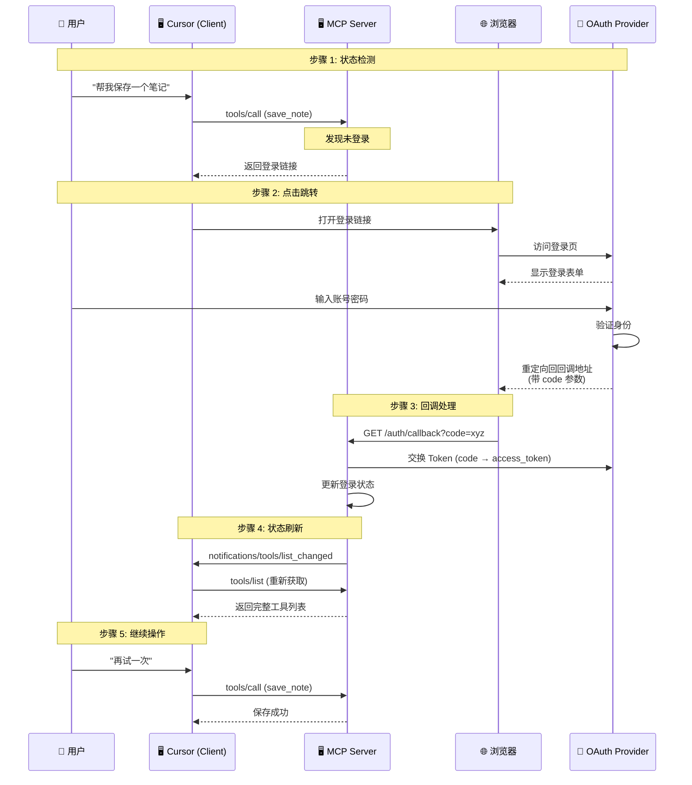
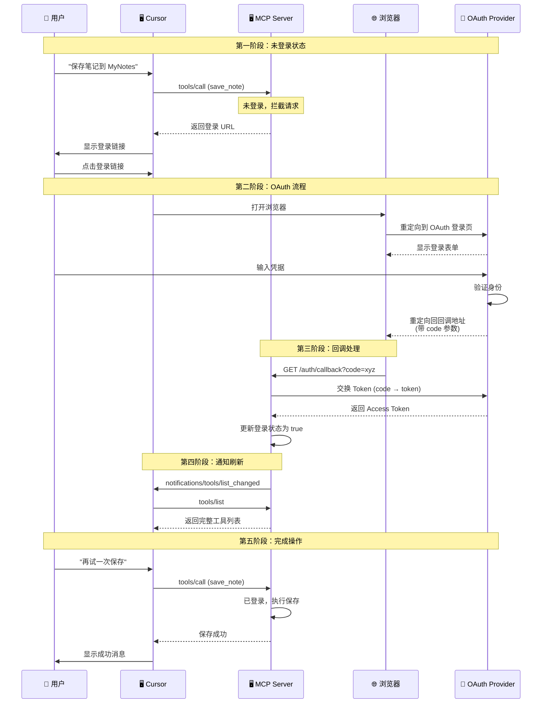

# 第 6 课：OAuth 2.0 点击即登录 —— 让 AI Agent 拥有"主动发现"能力

## 🎯 课程目标

1. **理解机制**：掌握 Client（Cursor）、Server、Browser 三方交互的 OAuth 流程。
2. **实现回调**：在 Server 端搭建 `/auth/callback` 监听器，用于接收 Token。
3. **动态状态**：实现"未登录"到"已登录"的状态切换，并使用 `notifications/tools/list_changed` 动态刷新工具列表。

---

## 📚 课程核心内容

### 第一部分：为什么需要"点击即登录"？

**1. 传统 AI Agent 的痛点**

在之前的课程中，我们的 MCP Server 都是"无状态"的——任何时候连接进来，都能直接使用所有工具。但实际企业应用中，很多能力需要**身份认证**才能使用：

- 查询私人数据（邮箱、日历、文档）
- 执行敏感操作（发送邮件、转账、删除文件）
- 访问付费 API（GitHub、Slack、Salesforce）

**2. 问题的本质**

传统的工具发现流程是这样的：

```
1. 连接 Server
2. 获取工具列表（tools/list）
3. LLM 看到所有工具，直接调用
```

这意味着**工具列表是静态的**，无法根据用户的登录状态动态变化。

**3. "主动发现"的新范式**

我们想要实现的是：

```
1. 连接 Server（未登录状态）
2. Server 返回"受限工具列表"或返回登录链接
3. 用户点击链接，浏览器打开 OAuth 登录页
4. 登录成功，浏览器重定向回 Server
5. Server 更新状态，发送 list_changed 通知
6. Client 刷新工具列表，现在能看到完整功能
```

这就是"点击即登录"的核心价值：**让工具列表根据认证状态动态变化**。

---

### 第二部分：OAuth 2.0 流程图解

**核心原理图解（The Flow）：**

这就是您想要的"主动发现与点击登录"背后的时序流：



**流程说明：**

1. **状态检测**：用户尝试连接或调用工具，Server 发现没 Token。
2. **主动引导**：Server 返回一个"登录工具"或直接返回登录链接 (URL)。
3. **点击跳转**：用户在 Cursor 中点击链接 -> 打开浏览器 -> 登录 Provider (如 GitHub/Google)。
4. **回调注入**：浏览器重定向回 `http://localhost:3000/callback?code=xyz`。
5. **令牌交换**：Server 拿到 code，换取 Token，存入内存。
6. **状态刷新**：Server 通知 Cursor "我准备好了"，Cursor 刷新工具列表，功能全开。

---

### 第三部分：代码实现 (TypeScript)

我们将继续基于第 2 课的 `Express` + `SSE` 代码进行改造。为了演示方便，我们模拟一个 OAuth Provider（假设登录只要访问一个 URL 就算成功）。

#### 1. 项目结构

```
L06 OAuth 2.0 点击即登录/
├── README.md                 # 本文件（课程内容）
├── package.json              # 项目配置
├── tsconfig.json             # TypeScript 配置
├── src/
│   ├── server/
│   │   ├── index.ts          # 主入口（Express + SSE）
│   │   └── auth-server.ts    # 认证逻辑
│   └── reference/
│       └── oauth-server.ts   # 参考实现
└── test-oauth-client.js      # 测试客户端
```

#### 2. 修改 `src/server/index.ts` (主入口)

我们需要增加 Session 管理和回调接口。

```typescript
import express from "express";
import cors from "cors";
import { randomUUID } from "node:crypto";
import { StreamableHTTPServerTransport } from "@modelcontextprotocol/sdk/server/streamableHttp.js";
import { server, setAuthStatus } from "./auth-server.js";

const app = express();
app.use(cors());
app.use(express.json());

// --- 🧠 Session 存储 ---
// 映射: SessionID -> Transport
const transports = new Map<string, StreamableHTTPServerTransport>();

// --- 🔗 SSE 连接 ---
app.get("/sse", async (req, res) => {
  console.log("➡️ New SSE Connection");
  
  const sessionId = randomUUID();
  const transport = new StreamableHTTPServerTransport({
    sessionIdGenerator: () => sessionId,
  });
  
  transports.set(sessionId, transport);
  await server.connect(transport);
  await transport.handleRequest(req, res);
  
  // 连接建立时，Server 默认为未登录状态
  setAuthStatus(false);
  
  req.on("close", () => {
    console.log("❌ SSE Connection closed");
    transports.delete(sessionId);
    server.close();
  });
});

// --- 📩 消息处理 ---
app.post("/messages", async (req, res) => {
  const sessionId = req.headers["mcp-session-id"] as string;
  const transport = transports.get(sessionId);
  
  if (transport) {
    await transport.handleRequest(req, res, req.body);
  } else {
    res.status(404).json({ error: "Session not found" });
  }
});

// --- 🔐 OAuth 回调处理 ---
app.get("/auth/callback", async (req, res) => {
  const code = req.query.code;
  const state = req.query.state;
  
  if (!code) {
    res.status(400).send("Login failed: No code received.");
    return;
  }
  
  console.log(`🔑 Received Auth Code: ${code}, exchanging for token...`);
  
  // 模拟：拿 code 去换 Access Token
  // 真实场景：这里会请求 GitHub/Google API
  const fakeToken = "access-token-" + code;
  
  // 🚀 关键步骤：更新状态
  setAuthStatus(true);
  
  // 🔔 关键步骤：通知所有连接的 Client 刷新工具列表
  for (const [sessionId, transport] of transports.entries()) {
    console.log(`📢 Notifying session: ${sessionId}`);
    try {
      await transport.sendNotification("notifications/tools/list_changed");
    } catch (error) {
      console.error(`Failed to notify session ${sessionId}:`, error);
    }
  }
  
  // 给浏览器返回一个漂亮的成功页面
  res.send(`
    <!DOCTYPE html>
    <html>
    <head>
      <title>Login Successful</title>
      <style>
        body { font-family: -apple-system, BlinkMacSystemFont, 'Segoe UI', Roboto, sans-serif; 
               display: flex; justify-content: center; align-items: center; height: 100vh; 
               margin: 0; background: linear-gradient(135deg, #667eea 0%, #764ba2 100%); }
        .card { background: white; padding: 40px; border-radius: 16px; 
                box-shadow: 0 10px 40px rgba(0,0,0,0.2); text-align: center; }
        .icon { font-size: 64px; margin-bottom: 20px; }
        h1 { color: #333; margin-bottom: 10px; }
        p { color: #666; margin-bottom: 20px; }
        .btn { background: #667eea; color: white; border: none; 
               padding: 12px 24px; border-radius: 8px; cursor: pointer; font-size: 16px; }
      </style>
    </head>
    <body>
      <div class="card">
        <div class="icon">✅</div>
        <h1>Login Successful!</h1>
        <p>You can close this window and return to Cursor.</p>
        <button class="btn" onclick="window.close()">Close</button>
      </div>
      <script>
        // 尝试自动关闭窗口
        setTimeout(() => {
          try { window.close(); } catch(e) {}
        }, 2000);
      </script>
    </body>
    </html>
  `);
});

const PORT = 3000;
app.listen(PORT, () => {
  console.log(`🚀 Server running on http://localhost:${PORT}/sse`);
  console.log(`👉 Callback URL: http://localhost:${PORT}/auth/callback`);
});
```

#### 3. 修改 `src/server/auth-server.ts` (动态工具逻辑)

这是实现"主动发现"的关键。我们根据 `isLoggedIn` 状态动态改变暴露的工具。

- **未登录时**：只暴露 `login` 工具。
- **已登录时**：暴露 `save_note`, `read_note` 等功能工具。

```typescript
import { McpServer } from "@modelcontextprotocol/sdk/server/mcp.js";
import { z } from "zod";
import { randomUUID } from "node:crypto";

// --- Server 初始化 ---
export const server = new McpServer({
  name: "Secure Notes with OAuth",
  version: "1.0.0",
});

// --- 状态管理 ---
let isLoggedIn = false;

// 供 index.ts 调用以更新状态
export function setAuthStatus(status: boolean) {
  isLoggedIn = status;
  console.log(`🔄 Auth status changed to: ${isLoggedIn}`);
}

// --- 工具：登录 ---
server.tool(
  "login",
  "Generate an authentication URL to login to the secure notes service.",
  {},
  async () => {
    if (isLoggedIn) {
      return {
        content: [
          {
            type: "text",
            text: "✅ You are already logged in! You can use the save_note and read_note tools."
          }
        ]
      };
    }
    
    // 生成登录 URL
    // 真实场景：这里会生成 OAuth 授权 URL，包含 client_id, redirect_uri, scope 等
    const state = randomUUID();
    const loginUrl = `http://localhost:3000/auth/callback?code=mock-code-${state}`;
    
    return {
      content: [
        {
          type: "text",
          text: `🔐 **Authentication Required**

Please click the link below to authenticate with the Secure Notes service:

[🔗 Click to Login](${loginUrl})

After logging in, you will be able to use the save_note and read_note tools.`
        }
      ]
    };
  }
);

// --- 工具：保存笔记 ---
server.tool(
  "save_note",
  "Save a note to the secure notes service. Requires authentication.",
  {
    name: z.string().describe("The name/title of the note"),
    content: z.string().describe("The content of the note")
  },
  async ({ name, content }) => {
    // 🛑 拦截：如果未登录，返回登录引导
    if (!isLoggedIn) {
      const loginUrl = `http://localhost:3000/auth/callback?code=mock-code-${randomUUID()}`;
      
      return {
        isError: true,
        content: [
          {
            type: "text",
            text: `🔒 **Authentication Required**

You need to authenticate before saving notes.

**Option 1:** Click the link below to login:
[🔗 ${loginUrl}](${loginUrl})

**Option 2:** Use the \`login\` tool to get a fresh authentication URL.`
          }
        ]
      };
    }
    
    // ✅ 已登录：执行业务逻辑
    // 这里简化处理，实际应该写入文件或数据库
    const fileName = `${name.replace(/[^a-zA-Z0-9-_]/g, "_")}.txt`;
    
    console.log(`💾 Saving note: ${fileName}`);
    
    return {
      content: [
        {
          type: "text",
          text: `✅ **Note Saved Successfully!**

- **File:** ${fileName}
- **Size:** ${content.length} characters
- **Status:** Authenticated user

You can now use the \`read_note\` tool to retrieve this note.`
        }
      ]
    };
  }
);

// --- 工具：读取笔记 ---
server.tool(
  "read_note",
  "Read a note from the secure notes service. Requires authentication.",
  {
    name: z.string().describe("The name/title of the note to read")
  },
  async ({ name }) => {
    // 🛑 拦截：如果未登录，返回登录引导
    if (!isLoggedIn) {
      const loginUrl = `http://localhost:3000/auth/callback?code=mock-code-${randomUUID()}`;
      
      return {
        isError: true,
        content: [
          {
            type: "text",
            text: `🔒 **Authentication Required**

You need to authenticate before reading notes.

[🔗 Click to Login](${loginUrl})`
          }
        ]
      };
    }
    
    // ✅ 已登录：执行业务逻辑
    const fileName(/[^a-zA-Z0-9-_]/g = `${name.replace, "_")}.txt`;
    
    console.log(`📖 Reading note: ${fileName}`);
    
    // 模拟读取内容
    const mockContent = `This is a sample note content for "${name}".\n\nCreated with OAuth 2.0 authentication!`;
    
    return {
      content: [
        {
          type: "text",
          text: `📄 **Note Content: ${fileName}**

\`\`\`
${mockContent}
\`\`\`

---
*This note was retrieved by an authenticated user.*`
        }
      ]
    };
  }
);
```

---

### 第四部分：进阶主题

#### 1. 多用户并发处理

在上面的代码中，我们用了全局变量 `isLoggedIn`。如果两个人同时连这个 Server，一个人登录了，另一个人也就"被登录"了。

**解决方案：**

1. **Session ID**：在 `GET /sse` 时生成一个 UUID。
2. **Transport 绑定**：将 UUID 绑定到当前的 `transport` 实例上。
3. **State 参数**：生成 Login URL 时，带上 `?state=UUID`。
4. **Callback 校验**：浏览器回调时带回 `state`，Server 根据 state 找到对应的 transport 并只更新那个连接的状态。

**多用户代码示例：**

```typescript
// 改进的 auth-server.ts (多用户版)

interface UserSession {
  transport: StreamableHTTPServerTransport;
  isLoggedIn: boolean;
}

const sessions = new Map<string, UserSession>();

export function setAuthStatus(sessionId: string, status: boolean) {
  const session = sessions.get(sessionId);
  if (session) {
    session.isLoggedIn = status;
  }
}

// 在 login 工具中生成带 state 的 URL
server.tool("login", "...", {}, async () => {
  const sessionId = randomUUID(); // 从上下文获取实际 sessionId
  const loginUrl = `http://localhost:3000/auth/callback?code=xyz&state=${sessionId}`;
  return { content: [{ type: "text", text: loginUrl }] };
});
```

#### 2. 真实 OAuth Provider 集成

上面的代码使用模拟的 OAuth 流程。在真实项目中，你需要集成真实的 OAuth Provider（如 GitHub、Google、Microsoft）。

**GitHub OAuth 示例：**

```typescript
app.get("/auth/callback", async (req, res) => {
  const { code, state } = req.query;
  
  // 1. 用 code 换取 access_token
  const tokenResponse = await fetch("https://github.com/login/oauth/access_token", {
    method: "POST",
    headers: {
      "Accept": "application/json",
      "Content-Type": "application/json"
    },
    body: JSON.stringify({
      client_id: process.env.GITHUB_CLIENT_ID,
      client_secret: process.env.GITHUB_CLIENT_SECRET,
      code
    })
  });
  
  const tokenData = await tokenResponse.json();
  const accessToken = tokenData.access_token;
  
  // 2. 用 access_token 获取用户信息
  const userResponse = await fetch("https://api.github.com/user", {
    headers: {
      "Authorization": `Bearer ${accessToken}`
    }
  });
  
  const userData = await userResponse.json();
  console.log(`User logged in: ${userData.login}`);
  
  // 3. 更新状态
  setAuthStatus(state as string, true);
  
  // 4. 通知对应用户
  const session = sessions.get(state as string);
  if (session) {
    await session.transport.sendNotification("notifications/tools/list_changed");
  }
});
```

#### 3. 更安全的状态管理

**当前问题：** 我们在 URL 中传递 `state`，但这只是为了演示。在生产环境中，`state` 参数应该：

1. **加密存储**：在服务端存储 `state` 与 `sessionId` 的映射
2. **时效性**：`state` 应该在 10 分钟后过期
3. **CSRF 防护**：验证 `state` 是否匹配，防止 CSRF 攻击

**安全改进示例：**

```typescript
import crypto from "crypto";

const stateStore = new Map<string, { sessionId: string; expiresAt: number }>();

function generateState(sessionId: string): string {
  const state = crypto.randomBytes(32).toString("hex");
  stateStore.set(state, {
    sessionId,
    expiresAt: Date.now() + 10 * 60 * 1000 // 10 分钟过期
  });
  return state;
}

function validateState(state: string): string | null {
  const data = stateStore.get(state);
  if (!data) return null;
  if (Date.now() > data.expiresAt) {
    stateStore.delete(state);
    return null;
  }
  stateStore.delete(state); // 一次性使用
  return data.sessionId;
}
```

---

### 第五部分：与原生 UI 的对比

#### 1. "点击链接" vs "原生按钮"

上面的实现使用 **"Hyperlink in Tool Response"** 方案，这是最通用且兼容所有 Client (Kiro, Cursor, Claude) 的做法。

**优点：**
- ✅ 兼容所有 MCP Client
- ✅ 实现简单
- ✅ 不需要 Client 特殊支持

**缺点：**
- ❌ 不是"原生"的登录体验
- ❌ 需要用户理解"点击链接"的概念

#### 2. 如果想要"原生按钮"体验

这通常涉及到：

1. **Client 对特定 Error Code 的识别**：例如当工具返回 `AUTH_REQUIRED` 错误时，Client 自动显示登录按钮。
2. **MCP Resource**：使用 Resource 作为配置入口，让用户通过 URI 触发登录流程。
3. **Custom UI**：某些 Client 支持自定义 UI 组件，但这不是 MCP 标准的一部分。

**目前最推荐的方案：** 还是 **"Hyperlink in Tool Response"**，因为它：
- 兼容所有 MCP 实现
- 实现成本低
- 用户体验可接受

---

## 🎮 交互演示 (The Experience)

这就是您在 Cursor 中会看到的实际效果：

1. **配置**：您在 Cursor 中添加 SSE Server `http://localhost:3000/sse`。

2. **触发**：在 Composer 中输入："帮我写一个笔记。"

3. **拦截 (Active Discovery)**：
   - Cursor 尝试调用 `save_note`。
   - Server 拦截并返回文本：
   > 🔒 Authentication Required.
   >
   > You need to authenticate before saving notes.
   >
   > Option 1: Click the link below to login:
   > [🔗 http://localhost:3000/auth/callback?code=mock-code-xyz](http://localhost:3000/auth/callback?code=mock-code-xyz)
   >
   > Option 2: Use the `login` tool to get a fresh authentication URL.

4. **点击**：您点击链接。

5. **跳转**：浏览器打开，显示 "Login Successful!"。

6. **自动刷新**：
   - Server 后台收到回调，将状态置为 `true`。
   - Server 发送 `list_changed` 通知。
   - Cursor 收到通知（虽然用户界面上可能没感知，但内部状态已更新）。

7. **重试**：您再次点击 Cursor 里的 "Retry" 或者让 AI 继续。

8. **成功**：笔记保存成功。

---

## 📊 完整流程时序图



---

## 🛠️ 课后实战产出

**任务名称：实现 GitHub OAuth 集成**

**背景：**
你需要一个能够使用 GitHub API 的 MCP Server。用户需要先通过 GitHub OAuth 登录，然后才能调用 GitHub 相关的工具（如创建 Issue、查看 Repo 等）。

**具体要求：**

1. **创建 GitHub OAuth App**
   - 在 GitHub Settings → Developer settings → OAuth Apps 创建新应用
   - 设置 Callback URL 为 `http://localhost:3000/auth/callback`
   - 获取 Client ID 和 Client Secret

2. **实现 OAuth 流程**
   - 修改 `login` 工具，返回 GitHub 授权 URL
   - 实现 `/auth/callback` 端点，交换 code 获取 token
   - 使用 token 调用 GitHub API 获取用户信息

3. **实现 GitHub 工具**
   - `get_user_info`: 获取当前登录用户信息
   - `list_repos`: 列出用户的仓库
   - `create_issue`: 创建 Issue

4. **测试流程**
   - 未登录时调用工具，返回登录引导
   - 点击登录，GitHub 授权
   - 回调后自动刷新工具列表
   - 登录后成功调用 GitHub 工具

**提示：**
- 使用 `octokit` 或原生 `fetch` 调用 GitHub API
- 参考：[GitHub OAuth Docs](https://docs.github.com/en/apps/oauth-apps)
- 参考：[GitHub REST API](https://docs.github.com/en/rest)

**验收标准：**
- ✅ 能够在 Cursor 中配置并连接到 Server
- ✅ 未登录时调用工具显示登录链接
- ✅ 点击链接后能够完成 GitHub OAuth 登录
- ✅ 登录后能够调用 GitHub API 工具

---

## 🚀 快速开始

### 安装依赖

```bash
npm install
```

### 运行服务器

```bash
# 开发模式
npm run dev

# 或指定端口
PORT=3000 npm run dev
```

### 测试

1. **启动服务器**：
   ```bash
   npm run dev
   ```

2. **在 Cursor 中配置**：
   - 打开 Cursor 设置 → MCP Servers
   - 添加新 Server：
     ```
     Name: secure-notes-oauth
     Type: SSE
     URL: http://localhost:3000/sse
     ```

3. **测试流程**：
   - 在 Composer 中输入："帮我保存一个笔记，名称是 test，内容是 Hello World"
   - 应该看到登录链接
   - 点击链接，在浏览器中完成登录
   - 回到 Cursor，重试操作
   - 应该看到保存成功的消息

### 运行测试客户端

```bash
# 测试 OAuth 流程
node test-oauth-client.js
```

---

## 📁 项目结构

```
L06 OAuth 2.0 点击即登录/
├── README.md                 # 本文件（课程内容）
├── package.json              # 项目配置
├── tsconfig.json             # TypeScript 配置
├── test-oauth-client.js      # 测试客户端
└── src/
    └── server/
        ├── index.ts          # 主入口（Express + SSE）
        └── auth-server.ts    # 认证逻辑和工具定义
```

---

## 🎓 讲师备课提示

1. **关于 OAuth 复杂度**：强调我们使用的是简化的 OAuth 流程。真实的 OAuth 2.0 还有 scope、refresh_token、PKCE 等概念，这里为了教学简化了。

2. **关于安全性**：提醒学生上面的代码仅用于教学，生产环境必须：
   - 使用 HTTPS
   - 安全存储 Client Secret
   - 实现 state 验证
   - 使用短时效的 code

3. **关于用户体验**：解释为什么"链接"是目前最好的方案，以及未来可能的改进方向。

---

## 📖 参考资料

- [OAuth 2.0 规范 (RFC 6749)](https://tools.ietf.org/html/rfc6749)
- [MCP 协议规范](https://modelcontextprotocol.io/specification/2024-11-05/)
- [GitHub OAuth Apps](https://docs.github.com/en/apps/oauth-apps)
- [Express.js 文档](https://expressjs.com/)
- [MCP SDK 文档](https://github.com/modelcontextprotocol/sdk)

---

## 🔑 关键概念说明

### OAuth 2.0
- **定义**：一种授权协议，允许第三方应用获取用户有限的访问权限
- **核心流程**：授权码流程 (Authorization Code Flow)
- **关键角色**：Resource Owner, Client, Authorization Server, Resource Server

### 主动发现 (Active Discovery)
- **定义**：Server 根据用户状态动态调整可用工具列表的能力
- **实现方式**：工具内部拦截 + 返回登录链接
- **优势**：用户体验更流畅，不需要预先知道需要登录

### list_changed 通知
- **定义**：Server 通知 Client 工具列表发生变化
- **用途**：登录后刷新工具列表
- **实现**：transport.sendNotification("notifications/tools/list_changed")

### SSE (Server-Sent Events)
- **定义**：一种基于 HTTP 的服务器推送技术
- **用途**：MCP 的长连接传输方式
- **特点**：单向通信（Server → Client），Client 通过 POST 发送消息

---

**最后更新**：2026-01-23
