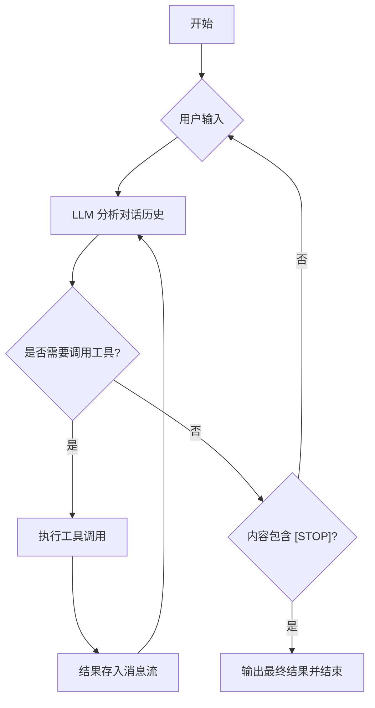

# L09 构建 Agentic AI - 自主代理循环 (Autonomous Agent Loop)

## 1. 什么是自主代理循环 (Autonomous Agent Loop)？

**自主代理循环 (Autonomous Agent Loop)**，有时也被简称为“单循环模式”，是构建 Agent 最基础、最直观的模式。

它的核心逻辑非常简单：**将 LLM 放入一个 `while (true)` 循环中。**

在每一轮循环中：
1. 我们将当前的对话历史（包括之前的工具结果）发送给 LLM。
2. LLM 分析当前情况。
3. 如果 LLM 认为需要调用工具，它就返回 `tool_calls`。
4. 我们执行工具，并将结果（Observation）直接作为 `role: tool` 的消息存回对话历史。
5. 继续下一次循环，直到 LLM 判定任务完成并在回复内容中给出终止信号（如 `[STOP]`）。

这个过程就像是一个人不断地：**看一眼任务 -> 做一点事 -> 看一眼结果 -> 再做一点事**，直到搞定。



## 2. 模式特点

### 优势 (Pros)
- **开发极其简单**：不需要复杂的状态机或多模型编排，只需处理 `tool_calls`。
- **天然的思维链**：LLM 在多轮对话中自然地维持了上下文，模型自己负责“复盘”。
- **低延迟**：省去了中间层的逻辑判断，直接由模型驱动进入下一步。

### 劣势 (Cons)
- **依赖单一强模型**：这种模式对模型的“规划能力”和“指令遵循能力”要求极高。如果模型不够强，很容易陷入死循环或在工具调用后忘记原始任务。
- **不可控性**：由于逻辑完全交给模型，很难干预中间的决策过程，也很难在特定步骤加入人工审核。
- **Token 消耗快**：每一轮循环都会带上完整的历史，随着轮次增加，Payload 会迅速变大。

## 3. 实现细节 (Implementation Notes)

在我们的 `src/index.ts` 实现中，有几个关键点：

1.  **终止判断**：我们通过在 System Prompt 中约定 `[STOP]` 作为任务完成标记。
    ```typescript
    if (message.content && message.content.includes('[STOP]')) {
      break;
    }
    ```
2.  **消息流向**：工具执行后的结果直接推入 `messages` 数组。下一轮 LLM 调用会看到：
    - user: "帮我查天气"
    - assistant: (tool_calls: getWeather)
    - tool: "北京天气晴"
    - assistant: "北京天气晴... [STOP]" (下一轮产生)

## 4. 运行参考

见 `src/index.ts`。运行 `npm run dev` (或直接用 ts-node 运行) 即可体验一个能够自主决定何时调用工具、何时结束的简单 Agent。

