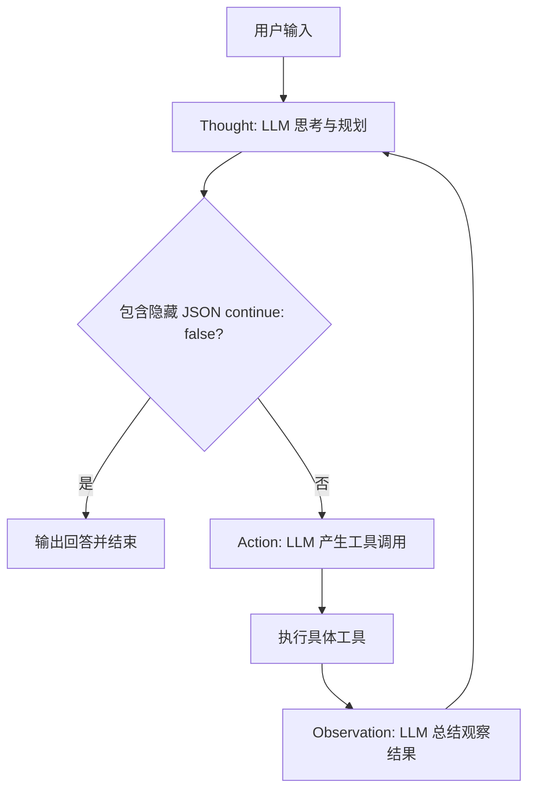

# L10 构建 Agentic AI - ReAct 模式

## 1. 什么是 ReAct 模式？

**ReAct (Reasoning + Acting)** 是一种由 Google 和普林斯顿大学提出的经典 Agent 模式。它的核心思想是：将 **推理（Reasoning）** 和 **行动（Acting）** 显式结合在一起。

- **Reasoning**: 生成思维链（Chain of Thought），解释为什么要这么做。
- **Acting**: 执行具体的工具调用，获取外部知识。

在 ReAct 模式下，Agent 会以一种循环的方式工作，直到任务完成：
`Thought -> Action -> Observation -> Thought -> ...`



## 2. 模式特点与优势

### 为什么需要这种模式？
1. **解决“幻觉”**：纯思维链（CoT）只能利用模型内部知识，容易产生幻觉。Action 允许模型获取外部实时数据。
2. **结构化流程**：强制模型先思考（Thought）再行动（Action），在执行工具后还要进行观察复盘（Observation），可以极大提高复杂任务的成功率。
3. **高可观测性**：开发者可以清晰地看到模型每一步的意图（Thought）和对结果的解读（Observation）。

## 3. 核心三要素 (Implementation in Code)

在我们的实现中（`src/index.ts`），ReAct 被拆分为三步明确的 LLM 调用：

1. **Thought**:
   - **目的**: 让模型分析现状，决定下一步。
   - **技巧**: 在请求时强行注入 `role: system, content: 'Thought: '`，诱导模型从思考开始。
2. **Action**:
   - **目的**: 专门产生工具调用指令（`tool_calls`）。
   - **技巧**: 设置 `temperature: 0` 保证调用的确定性。
3. **Observation**:
   - **目的**: **重点！** 这一步不是简单的打印工具结果，而是让模型阅读结果并给出“解读”。
   - **意义**: 这使得 Agent 能够理解“成功发送了消息”或者“没查到天气”对后续任务的影响。

## 4. 关键技术点

### 4.1 隐形终止符 (Hidden Termination)

为了让界面干净且逻辑严密，我们使用了 **三个零宽空格 (`\u200B\u200B\u200B`) + 隐藏 JSON** 的方式来判断结束：

- 模型回复：`经过查询，明天的天气很不错。 \u200B\u200B\u200B{"continue": false}`
- 程序逻辑：
  1. 通过 `split('\u200B\u200B\u200B')` 拆分内容。
  2. 前半部分显示给用户看。
  3. 后半部分解析为 JSON，如果是 `continue: false` 则跳出 `while` 循环。

### 4.2 模式对比

| 模式 | 实现方式 | 优点 | 缺点 |
| :--- | :--- | :--- | :--- |
| **自主代理循环 (L09)** | 一个 `while` + 简单 `tool_calls` | 快、开销小 | 模型容易发散、难以调试 |
| **ReAct (L10)** | 显式的三步循环 | **严谨、结构化、可复盘** | Token 消耗更高，多次往返 |

## 5. 运行代码

见 `src/index.ts`。我们采用了面向生产环境的思路，将 Thought、Action、Observation 显式分开，你可以通过控制台日志看到清晰的每一步推理过程。

```bash
# 运行示例
npm run dev
```