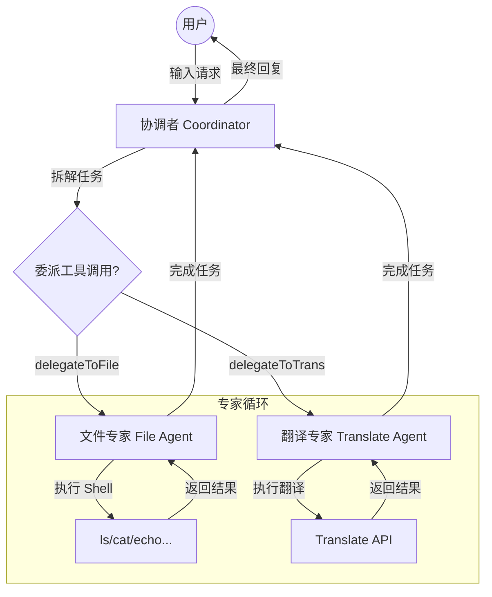

# L11 构建多 Agents 工作流：从“全能助手”到“专家协作”

https://github.com/user-attachments/assets/098f1a2b-c3d0-43f0-8f0f-75b257501800

在本课中，我们将探讨如何将 L09 中的**单 Agent 循环**演进为**多 Agents (Multi-Agents) 协作工作流**。

---

## 1. Single Agent vs Multi-Agent：为什么需要多个 Agent？

在 L09 中，我们构建了一个拥有所有工具权限的“全能 Agent”。但在处理复杂、跨领域的任务时，单 Agent 模式会面临以下挑战：

| 维度 | Single Agent (L09) | Multi-Agent (L11) |
| :--- | :--- | :--- |
| **工具管理** | 所有工具堆叠在一起。工具越多，模型选择越困难，容易产生幻觉。 | **工具隔离**。每个专家 Agent 只持有与其领域相关的工具。 |
| **角色专注度** | 系统提示词（System Message）必须兼顾所有任务。 | **角色定义清晰**。System Message 专门针对特定领域优化。 |
| **安全性** | 一个工具泄露或被误用（如 rm -rf）会危及全局。 | **最小权限原则**。不同 Agent 拥有不同权限边界（如文件 Agent 禁删）。 |
| **可扩展性** | 随着功能增加，Prompt 会变得极其臃肿且难以维护。 | **模块化解耦**。新增功能只需新增一个专家 Agent 并将其注册到协调者。 |

---

## 2. 角色定义的本质：System Message + 工具集

在多 Agent 架构中，一个 Agent 的“身份”并不是由不同的模型决定的（实际上，它们可能共用同一个模型实例），而是由以下两者共同定义的：

### 2.1 System Message 的意义（定义领域/角色）
System Message 不仅仅是简单的自我介绍，它定义了 **Agent 的心智模型、行为边界和输出规范**：
- **定义领域**：明确“你是文件助手”或“你是翻译助手”，让模型在大模型的庞大知识库中精准锚定特定技能。
- **约束行为**：例如在文件 Agent 的 System Message 中明确“禁止执行删除操作”，这提供了比工具参数校验更深层的语义级安全保障。
- **状态流转**：通过在 System Message 中约定 `[STOP]` 标识，让 Worker Agent 知道何时完成子任务并交还控制权。

### 2.2 工具集的意义（定义能力边界）
模型在执行特定 Agent 的逻辑时，只能看到该 Agent 拥有的工具。这种**能力的物理隔离**防止了模型在翻译时尝试调用 Shell 工具，提高了调用的准确率。

---

## 3. 架构模式：Coordinator + Worker

本示例采用经典的 **“协调者-执行者”** 模式：

1.  **协调者 (Coordinator)**：
    - **职责**：意图拆解、任务委派、结果汇总。
    - **特有工具**：委派工具（如 `delegateToFileAgent`, `delegateToTranslateAgent`）。
    - **心智**：它不直接干脏活，而是思考“这个子任务该找哪个专家”。

2.  **工作者 (Worker/Experts)**：
    - **职责**：在特定领域内执行具体工具。
    - **模式**：内部仍运行单 Agent 循环（ReAct 模式），直到任务完成。
    - **感知**：Worker 通常不需要感知自己是“被委派”的，它只需处理协调者发来的 `query`。



---

## 4. 本架构的优势

- **高准确率**：由于每个环节模型面对的工具和 Prompt 都极其精简，误操作率大幅下降。
- **逻辑复用**：翻译 Agent 既可以被“文件工作流”调用，也可以被“网页爬虫工作流”复用。
- **安全可控**：可以为不同的 Worker 设置不同的模型参数（如 Translation 用便宜的模型，Coding 用昂贵的模型）或不同的安全策略。
- **易于调试**：你可以清晰地看到任务在不同专家之间流转的过程，快速定位是“协调者分发错了”还是“执行者执行错了”。

---

## 5. Demo 展示

下面是一个完整的多 Agent 协作过程展示。

**用户需求**：*“看一下我 ~/downloads 里有多少关于设计的文件，整理出来之后翻译成英文，写到 ~/downloads/output.md 里。”*

### 协作全过程追踪：

1.  **协调者接收任务**：意识到需要先“获取文件列表”，调用 `delegateToFileAgent`。
2.  **文件专家执行**（[file Agent]）：
    - 调用 `ls -lh` 查看目录。
    - 调用 `grep` 筛选“设计”相关文件。
    - 返回整理好的中文文件清单。
3.  **协调者处理结果**：意识到需要“翻译”，调用 `delegateToTranslateAgent`。
4.  **翻译专家执行**（[translate Agent]）：
    - 调用翻译 API 处理文件清单。
    - 返回英文翻译内容。
5.  **协调者处理结果**：意识到最后一步是“写入文件”，再次调用 `delegateToFileAgent`。
6.  **文件专家执行**：
    - 调用 `echo "..." > output.md` 写入内容。
    - 返回“写入成功”的确认。
7.  **协调者汇总回复**：告诉用户所有步骤已完成。

> **Demo 运行日志片段：**
> ```text
> User: 看一下我 ~/downloads 文件夹里有多少关于设计的文件...
> AI: 我来帮您完成这个任务...
> Tool: delegateToFileAgent({"query": "列出 ~/downloads 文件夹中的所有文件，并筛选出包含\"设计\"或\"design\"相关关键词的文件"})
> 
>     [file Agent]
>     AI: 我来帮您列出文件并筛选...
>     Tool: runSafeShell({"command": "ls -la ~/downloads | grep -i \"设计\\|design\""})
>     ...
>     AI: 根据搜索结果，我为您列出了以下文件：[文件 A, 文件 B] [STOP]
> 
> AI: 现在我已经找到了所有文件。接下来，我需要将其翻译成英文：
> Tool: delegateToTranslateAgent({"content": "请将以下信息翻译成英文：..."})
> 
>     [translate Agent]
>     AI: 开始翻译...
>     Tool: translate({"text": "..."})
>     ...
>     AI: ## English List of Files: ... [STOP]
> 
> AI: 翻译完成，最后将其写入 output.md：
> Tool: delegateToFileAgent({"query": "将以下内容写入到 ~/downloads/output.md..."})
> ...
> AI: 任务全部完成！
> ```

---

## 6. 运行方式

### 环境配置
在项目根目录或本目录下创建 `.env` 文件，配置 API Key：
```bash
DEEPSEEK_API_KEY=your_api_key_here
```

### 安装与启动
```bash
cd "L11 构建多 Agents 工作流"
npm install
npm run dev
```

### 尝试这些指令：
- “列出当前目录下所有的 .ts 文件，并给每个文件写一个英文的简要说明。”
- “查找 ~/documents 下最近修改的 3 个文件，将它们的名字润色成更专业的英文。”

---

## 7. 代码结构速览

- `src/index.ts`：**主引擎**。定义协调者 System Message，管理多 Agent 循环嵌套。
- `src/agents/`：**专家定义层**。
  - `registry.ts`：Agent 注册表，将 Worker 转化为协调者可识别的工具。
  - `file.ts` / `translate.ts`：定义具体专家的 System Message 和独有工具集。
- `src/tools/`：**底层能力层**。具体的 Shell 执行、翻译 API 等原始工具实现。
- `src/llm/`：**通信层**。封装了大模型的接口调用逻辑。
