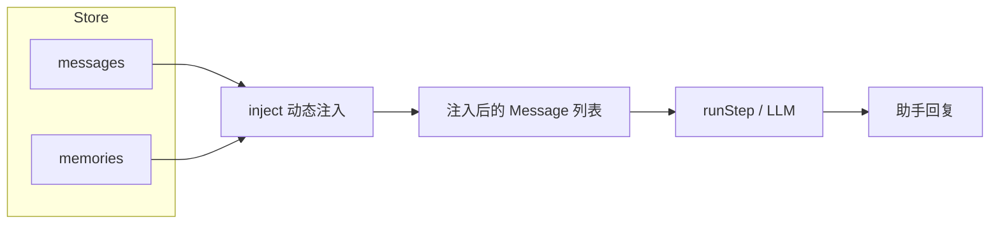
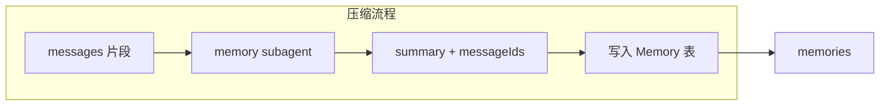

# L13 记忆 Subagent 与上下文压缩

本课实现「记忆 subagent」：负责记忆压缩、存储与按时间戳/索引的动态上下文注入。

## 1. 解决什么问题

- 长对话导致**上下文膨胀**、**token 超限**、成本与延迟上升。
- 需要「保留语义、可追溯」的压缩：既省 token，又能在需要时找回原文。

## 2. 为什么这样解决

- 用**记忆（Memory）**替代整段历史注入：请求 LLM 时不是把所有 messages 都塞进 context，而是「能用记忆替代的区间用记忆，否则用原始 message」。
- 通过 **message id** 建立记忆与原文的索引，支持按需加载原文（追究具体细节）。

## 3. 算法概要

### 3.1 注入算法

1. 根据约束（条数 / token 估算 / 时间窗口）截取「待注入的 messages」。
2. 按 message 顺序扫描：若当前 message 的 id 落在某条 **active** memory 的 `messageIds` 中，则在该区间**首次出现**时注入一条「记忆摘要」消息，并跳过该 memory 覆盖的其余 messages；否则注入**原始 message**。
3. 保证同一段对话只被一条记忆替代一次，不重复注入。

### 3.2 记忆生成

- 规则在 memory subagent 的 system prompt 中：如何做 summary（保留关键事实、决策、用户偏好等）、必须输出覆盖的 **messageIds**。
- 生成后写入 Memory 表，`status: 'active'`。

### 3.3 合并与状态

- 合并时：新记忆 `status: 'active'`，`messageIds` 为被合并记忆的并集；被合并的记忆 `status: 'inactive'`，`mergedIntoId` 指向新记忆。
- 注入时只使用 `status === 'active'` 的记忆。

## 4. 代码结构

```
L13 记忆 Subagent 与上下文压缩/
├── README.md
├── package.json
├── tsconfig.json
├── src/
│   ├── index.ts
│   ├── agents/
│   ├── subagents/
│   ├── memory/
│   ├── tools/
│   └── llm/
└── scripts/
    └── self-test.ts
```

## 5. 数据流与注入选择





**注入选择**：按 message 顺序扫描，若 id 落在某条 active memory 的 `messageIds` 内，则在该区间首次出现时输出一条「记忆摘要」，并跳过该区间其余 messages；否则输出原始 message。

## 6. 运行方式

```bash
cd "L13 记忆 Subagent 与上下文压缩"
npm install
# 配置 .env: DEEPSEEK_API_KEY=...
npm run dev
npm run test   # 自测（不调 LLM，仅测 store / inject / loadMessageDetail）
```
